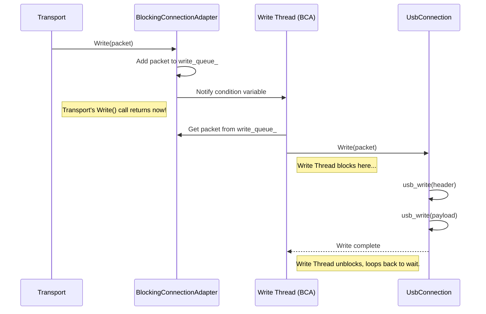

# Chapter 1: Connection (`Connection`/`BlockingConnection`)

Welcome to the `adb_codebase` tutorial! We're starting our journey at one of the fundamental layers: how ADB *actually* sends and receives raw data bytes across a connection like USB or a network socket.

## Motivation: Talking Through the Pipe

Imagine you have a physical pipe connecting your computer (the ADB host) to your Android device. You want to send messages back and forth. The [Transport (`atransport`)](02_transport___atransport__.md) layer (which we'll cover in Chapter 2) is responsible for understanding the *content* of ADB messages (like "install this app" or "run this shell command").

But *before* the Transport can worry about the message content, something needs to handle the grungy details of pushing the raw bytes representing that message *into* the pipe and pulling raw bytes *out* of the pipe. That's the job of the **Connection** layer.

Think of the `Connection` as the mechanism operating the pump and valves on our physical pipe. It deals with:

1.  **The Pipe Type:** Is it a USB cable? A network socket (like Wi-Fi ADB)? Each type needs slightly different handling to push/pull bytes.
2.  **Flow Control:** What if the pipe is full? What if there's no data to read yet? The Connection handles waiting (or *not* waiting, which we call blocking vs. non-blocking).
3.  **Raw Data:** It only deals with raw sequences of bytes, specifically formatted as ADB packets (`apacket` structures containing a header `amessage` and optional payload data). It doesn't know or care *what* those bytes mean in the larger ADB protocol.

This chapter explores how `adb_codebase` abstracts this raw data transfer using the `Connection` and `BlockingConnection` interfaces.

## Key Concepts

### 1. `BlockingConnection`: The Simple, Waiting Worker

The simplest way to think about sending data is: "Push these bytes into the pipe and *wait* until it's done." And for reading: "Wait until bytes arrive in the pipe, then give them to me." This "wait until done" approach is called **blocking I/O**.

The `BlockingConnection` is an *interface* (a contract or blueprint) in `transport.h` defining this blocking behavior:

```c++
// Simplified from transport.h
struct BlockingConnection {
  virtual ~BlockingConnection() = default;

  // Reads one ADB packet (header + payload).
  // WAITS if no data is available. Returns true on success.
  virtual bool Read(apacket* packet) = 0;

  // Writes one ADB packet (header + payload).
  // WAITS if the pipe is full. Returns true on success.
  virtual bool Write(apacket* packet) = 0;

  // Closes the connection immediately. Causes Reads/Writes to fail.
  virtual void Close() = 0;

  // Closes and potentially resets the underlying hardware (like USB).
  virtual void Reset() = 0;
};
```

*   **Why "Blocking"?** The `Read` and `Write` functions are expected to *block* the thread they are running on until the operation is complete. If you call `Read` and no data is ready, your code pauses right there.
*   **Implementations:** Different connection types provide concrete classes that *implement* this interface:
    *   `UsbConnection` (in `transport_usb.cpp`): Handles reading/writing over USB endpoints using blocking USB library calls.
    *   `FdConnection` (in `transport.h`): Handles reading/writing over file descriptors (like sockets) using blocking system calls.

Here's a tiny peek at `UsbConnection::Write`. Notice how it directly calls `usb_write`, which likely waits until the USB hardware sends the data.

```c++
// Simplified from transport_usb.cpp
bool UsbConnection::Write(apacket* packet) {
    // Send the 24-byte header
    if (usb_write(handle_, &packet->msg, sizeof(packet->msg)) != sizeof(packet->msg)) {
        // Error handling...
        return false;
    }

    // Send the payload, if any
    if (packet->msg.data_length != 0) {
         if (usb_write(handle_, packet->payload.data(), packet->msg.data_length) != packet->msg.data_length) {
            // Error handling...
            return false;
         }
    }

    // Success! The data has been sent (or at least accepted by the USB driver).
    return true;
}
```

### 2. `Connection`: The Efficient, Non-Waiting Worker

Waiting (blocking) is simple, but often inefficient. Imagine you have many connections to manage. If you dedicate one thread to wait on each connection, you might run out of threads quickly!

A more modern approach is **non-blocking I/O**, often used with an [Event Loop (`fdevent`)](09_event_loop___fdevent__.md) (Chapter 9). The idea is:

*   **Write:** "Try to send these bytes. If the pipe is full right now, *don't wait*, just tell me immediately, and I'll try again later when the event loop tells me the pipe is ready."
*   **Read:** "Check if any bytes are available. If yes, give them to me. If no, *don't wait*, just tell me, and the event loop will notify me when data arrives."

The `Connection` interface (also in `transport.h`) defines this non-blocking behavior:

```c++
// Simplified from transport.h
struct Connection {
    virtual ~Connection() = default;

    // Callback type: A function to call when a full packet is read.
    using ReadCallback = std::function<bool(Connection*, std::unique_ptr<apacket>)>;
    void SetReadCallback(ReadCallback callback); // Store the callback

    // Callback type: A function to call when an error occurs.
    using ErrorCallback = std::function<void(Connection*, const std::string&)>;
    void SetErrorCallback(ErrorCallback callback); // Store the callback

    // Tries to send a packet. Returns immediately.
    // Returns true if the packet was accepted for sending (might not be sent yet!).
    // Returns false on immediate error.
    virtual bool Write(std::unique_ptr<apacket> packet) = 0;

    // Start processing reads/writes (e.g., register with the event loop).
    virtual void Start() = 0;

    // Stop processing and clean up.
    virtual void Stop() = 0;

    // Stop and potentially reset the underlying hardware.
    virtual void Reset();

    // ... internal members like callbacks ...
    ReadCallback read_callback_;
    ErrorCallback error_callback_;
};
```

*   **Key Difference:** No `Read` method! Instead, you provide a `ReadCallback`. The `Connection` implementation will call *your* callback function whenever it successfully reads a complete packet, asynchronously. The `Write` method doesn't guarantee the data is sent immediately; it just queues it up.
*   **Implementation:** `NonblockingFdConnection` (in `transport_fd.cpp`) directly implements this for file descriptors using non-blocking system calls and integration with an event loop mechanism.

### 3. `BlockingConnectionAdapter`: The Bridge

We have a problem:

*   The higher-level [Transport (`atransport`)](02_transport___atransport__.md) layer is designed to work efficiently with the *non-blocking* `Connection` interface.
*   But some of our underlying pipes (like USB via `UsbConnection`) are inherently *blocking*.

How do we bridge this gap? With the `BlockingConnectionAdapter` (in `transport.cpp`).

It's a clever adapter that:

1.  **Takes** a `BlockingConnection` (like `UsbConnection`) as input.
2.  **Implements** the *non-blocking* `Connection` interface.
3.  **Secretly** uses background threads to perform the blocking operations.

```c++
// Simplified Conceptual Structure of BlockingConnectionAdapter
class BlockingConnectionAdapter : public Connection {
public:
    // Takes ownership of a BlockingConnection
    BlockingConnectionAdapter(std::unique_ptr<BlockingConnection> connection);

    // --- Implements Connection interface ---
    bool Write(std::unique_ptr<apacket> packet) override;
    void Start() override;
    void Stop() override;
    // ...

private:
    std::unique_ptr<BlockingConnection> underlying_; // The actual blocking pipe (e.g., UsbConnection)
    std::thread read_thread_;  // Thread to run the blocking Read()
    std::thread write_thread_; // Thread to run the blocking Write()
    std::deque<std::unique_ptr<apacket>> write_queue_; // Queue for outgoing packets
    std::mutex mutex_;         // For protecting shared data
    std::condition_variable cv_; // For signaling the write thread
    // ... (Callbacks inherited from Connection)
};
```

*   **How it works:**
    *   When `Start()` is called, it launches two threads:
        *   **Read Thread:** Continuously calls `underlying_->Read()` (e.g., `UsbConnection::Read()`). This call blocks the *read thread* (not the main thread). When it gets a packet, it calls the `read_callback_` provided to the Adapter.
        *   **Write Thread:** Waits for packets to appear in `write_queue_`. When `Write()` is called on the Adapter, the packet is just added to the queue, and the write thread is notified. The write thread wakes up, takes a packet from the queue, and calls `underlying_->Write()` (e.g., `UsbConnection::Write()`). This blocks the *write thread*.
    *   The `Write()` call on the `BlockingConnectionAdapter` returns almost immediately (it just adds to a queue).
    *   Reads happen asynchronously via the callback.

This adapter makes a blocking pipe *look* non-blocking to the rest of the system (like the Transport layer).

## How it Works: Sending a Packet over USB

Let's trace how the `Transport` sends a packet (`apacket`) using a USB connection.

1.  **Transport Layer:** Has a packet `p` to send. It holds a `Connection` object. In the USB case, this is actually a `BlockingConnectionAdapter` instance wrapping a `UsbConnection`.
2.  **Transport Call:** `transport->Write(p)` calls `BlockingConnectionAdapter::Write(p)`.
3.  **Adapter Enqueue:** `BlockingConnectionAdapter::Write` locks the mutex, adds `p` to its internal `write_queue_`, unlocks, and notifies its write thread via the condition variable `cv_`. This function returns `true` almost instantly.
4.  **Write Thread Wakes:** The dedicated write thread inside the adapter was waiting on `cv_`. It wakes up, locks the mutex, takes packet `p` from the front of `write_queue_`, and unlocks.
5.  **Blocking Write:** The write thread calls `underlying_->Write(p)`. Since `underlying_` is the `UsbConnection`, this calls `UsbConnection::Write(p)`.
6.  **USB Hardware:** `UsbConnection::Write` calls the blocking `usb_write()` function twice (once for the header, once for the payload). The *write thread* waits here until the USB subsystem has accepted/sent the data.
7.  **Completion:** Once `usb_write()` returns, `UsbConnection::Write` returns to the write thread. The write thread loops back to wait for more packets on the `cv_`.



Receiving data works similarly but uses the read thread and the `read_callback_`. The read thread calls `UsbConnection::Read()`, which blocks waiting for `usb_read()`. When data arrives, the read thread gets the packet and calls the `read_callback_` (which was originally set by the Transport layer) to pass the packet upwards.

## Implementations Under the Hood

Let's look briefly at the concrete implementations.

### `UsbConnection` (Blocking USB - `transport_usb.cpp`)

*   Uses a `usb_handle*` which represents the low-level USB device connection.
*   `Read(apacket* p)`:
    *   Calls `usb_read()` to get the `amessage` header (24 bytes). This blocks if no data is ready.
    *   Checks `p->msg.data_length`.
    *   If `data_length > 0`, calls `usb_read()` again to get exactly `data_length` bytes for the payload. This also blocks.
*   `Write(apacket* p)`:
    *   Calls `usb_write()` to send the `amessage` header. Blocks until sent.
    *   If `data_length > 0`, calls `usb_write()` to send the payload. Blocks until sent.
*   `Close()` / `Reset()`: Call functions like `usb_kick()` or `usb_reset()` to signal the USB device or reset the connection.

### `FdConnection` (Blocking File Descriptor - `transport.h`/`transport.cpp`)

*   Uses a `unique_fd` (a smart pointer for a file descriptor, often representing a network socket).
*   `Read(apacket* p)`:
    *   Calls helper `ReadFdExactly(fd, &p->msg, sizeof(amessage))`. This helper (likely in `adb_io.cpp` or `sysdeps`) repeatedly calls the OS `read()` or `recv()` system call until exactly 24 bytes are read, blocking as necessary.
    *   If `data_length > 0`, calls `ReadFdExactly(fd, p->payload.data(), p->msg.data_length)` to read the payload, blocking as necessary.
*   `Write(apacket* p)`:
    *   Calls `WriteFdExactly(fd, &p->msg, sizeof(amessage))`. This helper repeatedly calls `write()` or `send()` until all 24 bytes are sent, blocking if the OS buffers are full.
    *   If `data_length > 0`, calls `WriteFdExactly(fd, p->payload.data(), p->msg.data_length)` for the payload, blocking as necessary.
*   `Close()`: Calls `adb_shutdown()` on the file descriptor, then closes it.

### `NonblockingFdConnection` (Non-Blocking File Descriptor - `transport_fd.cpp`)

*   This one *directly* implements the `Connection` interface (not `BlockingConnection`).
*   It sets the file descriptor to non-blocking mode (`O_NONBLOCK`).
*   It uses an event notification mechanism (like `adb_poll` on Linux/Mac or `WaitForMultipleObjects` on Windows, managed by the [Event Loop (`fdevent`)](09_event_loop___fdevent__.md)).
*   `Start()` registers the file descriptor with the event loop.
*   The event loop notifies the `NonblockingFdConnection` when the FD is readable or writable.
*   When notified for readability: It calls non-blocking `adb_read()`. It might only get *part* of a packet. It buffers the partial data internally. When a full packet (header + payload) is assembled, it calls the `read_callback_`.
*   `Write()`: It tries to `adb_write()` the header and payload. If the OS call returns `EAGAIN` or `EWOULDBLOCK` (meaning "try again later"), it buffers the remaining data and asks the event loop to notify it when the FD becomes writable again.

## Conclusion

The `Connection` / `BlockingConnection` layer is ADB's foundation for moving raw bytes. It abstracts away the specifics of USB vs. Sockets and handles the fundamental blocking or non-blocking nature of I/O operations.

*   `BlockingConnection` is simple: Read/Write operations wait. Used by `UsbConnection` and `FdConnection`.
*   `Connection` is efficient: Read/Write operations don't wait; uses callbacks and interacts with an event loop.
*   `BlockingConnectionAdapter` is the crucial bridge, making blocking connections (like USB) appear non-blocking to the higher layers by using background threads.

Now that we understand how raw ADB packets (`apacket`s) are physically sent and received, we can move up a level. In the next chapter, we'll explore the [Transport (`atransport`)](02_transport___atransport__.md), which manages the overall connection state, handles authentication, and routes these packets between the host and device services.

**Next:** [Chapter 2: Transport (`atransport`)](02_transport___atransport__.md)

---

Generated by [AI Codebase Knowledge Builder](https://github.com/The-Pocket/Tutorial-Codebase-Knowledge)