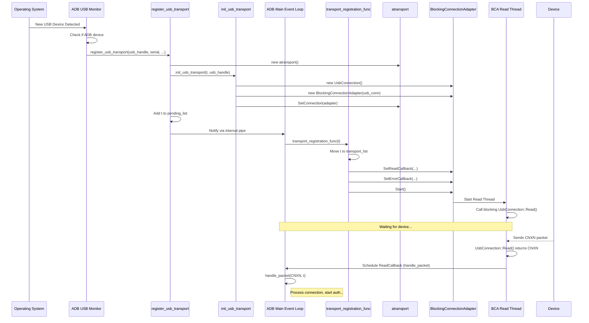

# Chapter 2: Transport (`atransport`)

Welcome back! In [Chapter 1: Connection (`Connection`/`BlockingConnection`)](01_connection___connection___blockingconnection__.md), we learned how ADB sends and receives raw bytes (as `apacket` structures) through different kinds of "pipes" like USB or network sockets using the `Connection` layer.

But just sending bytes isn't the whole story. How does ADB know *which* device it's talking to? How does it make sure the connection is secure? How does it manage multiple devices connected at the same time? That's where the **Transport (`atransport`)** layer comes in.

## Motivation: Managing the Pipes

Imagine you have several Android devices plugged into your computer via USB, plus maybe an emulator running. Each one has its own physical or virtual "pipe" connecting it to the ADB server running on your computer.

Chapter 1 showed us the `Connection` layer, which acts like the worker operating the pump on *one* specific pipe, pushing and pulling raw bytes.

Now, we need a **manager** for each pipe. This manager is the `atransport`. Its job is to:

1.  **Identify the Pipe:** Know which specific device this pipe connects to (using a serial number like `emulator-5554` or `ABCDEFG123`).
2.  **Track the Status:** Know if the device is `online`, `offline`, needs `authorization`, or is in `bootloader` mode.
3.  **Handle Security:** Manage the authentication process ([Authentication (`adb_auth`)](03_authentication___adb_auth__.md)) to make sure we're talking to the right, trusted device.
4.  **Direct Traffic:** Look at the messages (`apacket`s) coming through the pipe and send them to the correct ADB service (like the shell or file sync) or handle core protocol messages itself.
5.  **Use the Worker:** Tell the underlying `Connection` object (from Chapter 1) *when* and *what* raw bytes to send or receive.

Essentially, for every device ADB talks to, there's one `atransport` object managing the high-level communication logic for that specific device's pipe.

## Key Concepts

### 1. The `atransport` Object: One Manager Per Device

The core idea is the `atransport` class (defined in `transport.h`). Think of it as an object that represents *one single communication channel* to a specific Android device or emulator.

*   If you have 3 devices connected, the ADB server will have 3 `atransport` objects, one for each device.
*   Each `atransport` holds information specific to that device's connection.

```c++
// Extremely simplified view of atransport from transport.h
class atransport {
public:
    // --- Identification ---
    const TransportId id;      // A unique number for this transport instance
    std::string serial;        // Device serial number (e.g., "ABCDEFG123")
    std::string devpath;       // System device path (for USB)
    TransportType type;      // Is it USB (kTransportUsb) or TCP/IP (kTransportLocal)?

    // --- State Management ---
    ConnectionState GetConnectionState() const; // What's the current status?
    void SetConnectionState(ConnectionState state); // Update the status

    // --- Underlying Connection ---
    // Holds the actual pipe worker (often a BlockingConnectionAdapter)
    std::shared_ptr<Connection> connection();
    void SetConnection(std::unique_ptr<Connection> connection);

    // --- Communication ---
    int Write(apacket* p); // Send a packet *down* to the device via the Connection
    // (Reading happens via callbacks set on the Connection)

    // --- Features & Protocol ---
    int get_protocol_version() const;  // What ADB protocol version are we using?
    size_t get_max_payload() const;    // Max data size per packet?
    bool has_feature(const std::string& feature) const; // Does the device support "shell_v2"?
    void SetFeatures(const std::string& features_string); // Store supported features

    // --- Authentication ---
#if ADB_HOST
    std::shared_ptr<RSA> NextKey(); // Get the next key to try for authentication
#endif
    // ... other members for auth state, tracking sockets, etc. ...

private:
    std::atomic<ConnectionState> connection_state_; // e.g., kCsOnline, kCsOffline
    std::shared_ptr<Connection> connection_;       // The actual pipe worker
    FeatureSet features_;                          // Features supported by the device
    // ... many other details ...
};
```

*   **Key Takeaway:** An `atransport` bundles together all the information and state needed to manage the ADB communication link for *one* specific device.

### 2. Connection State (`ConnectionState`)

A crucial job of `atransport` is tracking the device's status. This is stored in the `connection_state_` member. Common states include:

*   `kCsConnecting`: The transport is trying to establish a connection.
*   `kCsAuthorizing`: The transport is established, but we're waiting for the user to approve the RSA key on the device.
*   `kCsUnauthorized`: The user denied the RSA key, or the key is wrong. ADB can't talk securely.
*   `kCsOnline` / `kCsDevice`: Hooray! The transport is connected, authenticated, and ready for commands. (`kCsDevice` is often used as a synonym for `kCsOnline` on the host).
*   `kCsOffline`: The ADB server sees the device (e.g., USB device detected), but it can't talk to the `adbd` daemon on it. Maybe the device is off, booting, or hasn't started `adbd` yet.
*   `kCsBootloader`: The device is in the bootloader (fastboot) mode.
*   `kCsRecovery`: The device is in recovery mode.

The ADB server constantly updates the state of each transport based on connection attempts, authentication results, and messages received from the device. You see these states when you run `adb devices`.

### 3. Using the `Connection` Layer

How does the `atransport` actually send and receive data? It delegates the raw byte handling to the `Connection` layer we saw in [Chapter 1](01_connection___connection___blockingconnection__.md)!

*   The `atransport` holds a pointer (`connection_`) to a `Connection` object.
*   Remember the `BlockingConnectionAdapter`? For USB connections, the `atransport`'s `connection_` pointer usually points to one of these adapters, which internally uses a `UsbConnection` and background threads. For TCP connections, it might point to a `NonblockingFdConnection` or an adapter around an `FdConnection`.
*   **Sending:** When some part of ADB wants to send a message (an `apacket`), it calls `atransport->Write(packet)`. The `atransport::Write` method simply passes the packet along to its underlying `connection_->Write(packet)`.
*   **Receiving:** When the underlying `Connection` (via its background thread or event loop) successfully reads a complete `apacket`, it calls the `ReadCallback` that the `atransport` layer set up during initialization. This callback typically calls a function like `handle_packet`, which is the entry point for processing incoming ADB messages within the transport layer.

```cpp
// Simplified sending logic in transport.cpp
int atransport::Write(apacket* p) {
    // The transport asks its connection worker to send the packet.
    // The connection_ object could be a BlockingConnectionAdapter or NonblockingFdConnection.
    bool success = this->connection()->Write(std::unique_ptr<apacket>(p));
    return success ? 0 : -1; // Return 0 on success, -1 on failure
}

// Simplified receiving setup in transport.cpp (inside transport_registration_func)
void setup_transport_callbacks(atransport* t) {
    // Tell the connection worker what function to call when a packet arrives
    t->connection()->SetReadCallback([t](Connection*, std::unique_ptr<apacket> p) {
        // Basic validation
        if (!check_header(p.get(), t)) {
            D("%s: remote read: bad header", t->serial.c_str());
            return false; // Signal connection to stop reading
        }

        // Packet looks okay, pass it up for processing
        apacket* packet_ptr = p.release(); // Transfer ownership
        // Schedule handle_packet to run on the main ADB thread
        fdevent_run_on_main_thread([packet_ptr, t]() {
             handle_packet(packet_ptr, t); // The main entry point for incoming packets
        });
        return true; // Signal connection to continue reading
    });

    // Tell the connection worker what function to call if the pipe breaks
    t->connection()->SetErrorCallback([t](Connection*, const std::string& error) {
        LOG(INFO) << t->serial_name() << ": connection terminated: " << error;
        // Schedule cleanup logic to run on the main ADB thread
        fdevent_run_on_main_thread([t]() {
            handle_offline(t); // Mark the transport as offline
            // ... potentially other cleanup ...
        });
    });

    // Tell the connection worker to start its reading/writing threads/event handling
    t->connection()->Start();
}
```

*   **Analogy:** The `atransport` manager tells the `Connection` pipe worker: "Here's a packet to send out" (`Write`). And it also says: "Let me know whenever a full packet arrives by calling this `handle_packet` function" (`SetReadCallback`). It also says "Tell me if the pipe breaks" (`SetErrorCallback`).

### 4. Transport Registration and Discovery

How does an `atransport` object get created in the first place?

*   **USB:** When you plug in a device, the operating system notifies ADB. A platform-specific part of ADB (like `usb_linux.cpp` or `usb_windows.cpp`) detects the new USB device. If it looks like an Android device in ADB mode, it calls `register_usb_transport`.
*   **TCP/IP (Network ADB/Emulator):**
    *   **Emulator:** ADB actively scans standard emulator ports (5555, 5557, etc.) by trying to connect. If a connection succeeds, it calls `register_socket_transport`. Emulators can also sometimes tell the host ADB directly when they start.
    *   **Network Device (`adb connect`):** When you run `adb connect IP:PORT`, the ADB client tells the server to try connecting. If successful, the server calls `register_socket_transport`.

The `register_usb_transport` and `register_socket_transport` functions do the initial setup:
1.  Create a new `atransport` object.
2.  Create the underlying `BlockingConnection` (e.g., `UsbConnection`, `FdConnection`).
3.  Wrap it in a `BlockingConnectionAdapter` (if needed) to provide the non-blocking `Connection` interface.
4.  Store the `Connection` pointer inside the `atransport`.
5.  Add the new `atransport` to a list of pending transports.
6.  Notify the main ADB event loop ([Event Loop (`fdevent`)](09_event_loop___fdevent__.md)) that a new transport needs final registration.

The main loop then picks up the pending transport, sets up the read/error callbacks, starts the connection, and moves the transport to the main active list.

## How it Works: USB Device Connection

Let's trace the high-level steps when you plug in a USB Android device:

1.  **OS Detects USB:** Your computer's operating system detects a new USB device.
2.  **ADB USB Monitor:** A background part of the ADB server notices this new USB device. It checks its USB descriptors (Vendor ID, Product ID, etc.).
3.  **Is it ADB?** The monitor determines if this device is an Android device in ADB mode (using `is_adb_interface`).
4.  **Create Transport:** If it is, the monitor calls `register_usb_transport`.
    *   `register_usb_transport` creates a new `atransport* t`.
    *   It calls `init_usb_transport(t, usb_handle)`.
        *   `init_usb_transport` creates a `std::make_unique<UsbConnection>(usb_handle)`.
        *   It wraps this in a `std::make_unique<BlockingConnectionAdapter>(...)`.
        *   It calls `t->SetConnection(...)` to store the adapter in the transport.
    *   It sets `t->serial`, `t->devpath`, etc.
    *   It adds `t` to the `pending_list`.
    *   It calls `register_transport(t)`.
5.  **Notify Main Loop:** `register_transport` sends a small message through an internal pipe (`transport_registration_send`) to wake up the main ADB event loop.
6.  **Main Loop Action:** The [Event Loop (`fdevent`)](09_event_loop___fdevent__.md) wakes up, reads the message, and gets the `atransport* t`. It calls `transport_registration_func`.
7.  **Final Setup:** `transport_registration_func` moves `t` from `pending_list` to `transport_list`. It calls the `setup_transport_callbacks` logic (shown earlier) to set the `ReadCallback` and `ErrorCallback` on the `t->connection()` adapter. It then calls `t->connection()->Start()`.
8.  **Connection Starts:** The `BlockingConnectionAdapter` starts its internal read and write threads. The read thread immediately calls the blocking `UsbConnection::Read()`, waiting for the first packet from the device (usually a `CNXN` packet). The write thread waits for outgoing packets.
9.  **Device Responds:** The device sends a `CNXN` (connect) packet.
10. **Packet Received:** The `UsbConnection::Read()` returns the `CNXN` packet to the adapter's read thread. The read thread calls the `ReadCallback`.
11. **Packet Handled:** The `ReadCallback` schedules `handle_packet(cnxn_packet, t)` to run on the main thread. `handle_packet` processes the `CNXN` packet, potentially starting the authentication process ([Authentication (`adb_auth`)](03_authentication___adb_auth__.md)).



This flow establishes the managed communication channel (`atransport`) built on top of the raw byte pipe (`Connection`).

## Conclusion

The `atransport` is the central manager for communication with a single ADB device. It bridges the gap between low-level byte transfer (`Connection`) and the higher-level ADB protocol logic.

*   It represents **one connection** to one device.
*   It tracks the device's **state** (`kCsOnline`, `kCsOffline`, etc.).
*   It **uses** an underlying `Connection` (like `BlockingConnectionAdapter`) to send/receive raw `apacket`s.
*   It handles **authentication** and **routes** incoming packets based on the ADB protocol.
*   New transports are **registered** when devices are detected (USB or TCP/IP).

Now that we understand how ADB manages the connection channel itself with `atransport`, we can dive into one of its most important initial tasks: verifying the identity of the host and device.

**Next:** [Chapter 3: Authentication (`adb_auth`)](03_authentication___adb_auth__.md)

---

Generated by [AI Codebase Knowledge Builder](https://github.com/The-Pocket/Tutorial-Codebase-Knowledge)