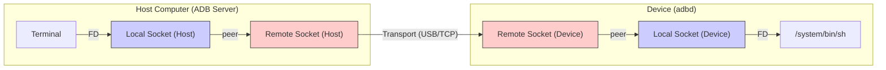
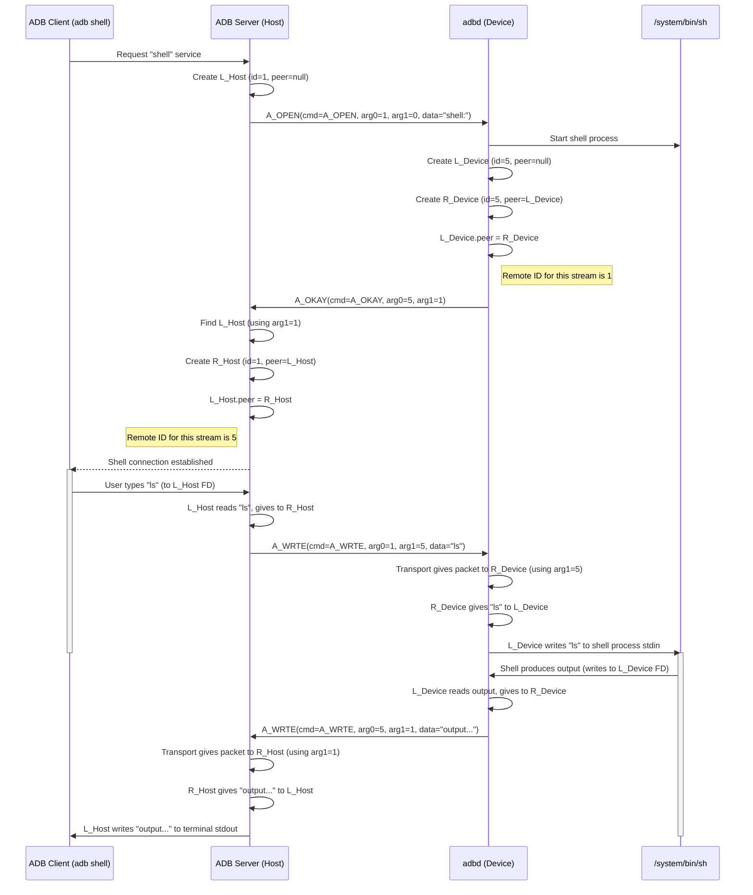

# Chapter 5: Socket (`asocket`)

Welcome back! In [Chapter 4: ADB Protocol & Messaging](04_adb_protocol___messaging.md), we learned about the "language" of ADB – the `apacket` structure used to send commands and data between the client, server, and device daemon. We saw how commands like `A_CNXN`, `A_AUTH`, and `A_WRTE` are packaged.

But how does ADB handle multiple things happening at once? For example, how can you run an `adb shell` command in one terminal while also running `adb logcat` in another, all over the same single USB cable connection ([Transport (`atransport`)](02_transport___atransport__.md))? We need a way to manage these separate, simultaneous conversations. That's where the **Socket (`asocket`)** comes in.

## Motivation: Multiple Phone Calls on One Line

Think of the [Transport (`atransport`)](02_transport___atransport__.md) as the main phone line connecting your computer to your Android device. It's the physical cable or the Wi-Fi connection. Now, imagine you want to have several phone calls happening *at the same time* over that single line:

1.  One call to the device's "shell" service.
2.  Another call to the device's "logcat" service.
3.  Maybe a third call to transfer a file using the "sync" service.

How do you keep the conversations separate? You wouldn't want the shell output accidentally going to the logcat window! You need a way to manage each individual call or **logical data stream**.

In ADB, the `asocket` (ADB Socket) is the abstraction that represents **one end** of such a logical data stream. When you start an ADB service like `shell`, the system sets up a *pair* of `asocket` objects:

*   One `asocket` on the initiating side (e.g., the ADB server on your computer).
*   Another `asocket` on the receiving side (e.g., the `adbd` daemon on your device).

These two `asocket`s form a dedicated virtual channel, like a specific phone call, running over the main `Transport` line. Data sent into one `asocket` of the pair comes out of the other, ensuring that the `shell` conversation stays separate from the `logcat` conversation.

## Key Concepts

### 1. `asocket`: One End of a Stream

The `asocket` structure (defined in `socket.h`) represents a single endpoint for a logical stream of ADB data. It doesn't represent the entire connection, just one side of a specific conversation (like the shell, or logcat, or file sync).

### 2. Local vs. Remote Sockets

There are two main flavors of `asocket`:

*   **Local Socket (`create_local_socket`)**: This type of `asocket` is usually connected to something *local* on the machine it's running on.
    *   On the ADB server (host computer), a local socket might be connected to the standard input/output of your terminal when you run `adb shell`.
    *   On the `adbd` daemon (device), a local socket might be connected to the actual `/system/bin/sh` process that gets started.
    *   It reads and writes data using a standard file descriptor (`fd`).

*   **Remote Socket (`create_remote_socket`)**: This type of `asocket` represents the *connection to the other side* via the [Transport (`atransport`)](02_transport___atransport__.md). It doesn't have its own file descriptor.
    *   When it needs to send data, it packages the data into an `A_WRTE` packet (using the protocol from [Chapter 4](04_adb_protocol___messaging.md)) and sends it over the `Transport`.
    *   When an `A_WRTE` packet arrives from the `Transport`, the `Transport` directs it to the correct remote socket.

### 3. Socket Pairs (`peer`)

Sockets almost always work in pairs. Each `asocket` has a `peer` pointer.

*   A **local socket**'s peer is typically a **remote socket**. When the local socket reads data from its file descriptor (e.g., you typing in the shell), it gives that data to its remote socket peer. The remote socket then packages it into an `A_WRTE` packet and sends it over the transport.
*   A **remote socket**'s peer is typically a **local socket**. When the remote socket receives an `A_WRTE` packet from the transport, it unpacks the data and gives it to its local socket peer. The local socket then writes that data to its file descriptor (e.g., displaying shell output in your terminal).



This pair ensures data flows correctly between the local entity (terminal/shell process) and the remote connection.

### 4. Stream IDs (`local_id`, `remote_id`)

How does the `Transport` know which `asocket` pair an incoming `A_WRTE` or `A_OKAY` packet belongs to, especially when multiple streams (shell, logcat) are active?

Through **socket IDs**. Each `asocket` has a unique `id` number *within its side* of the connection (host or device). When a stream is set up (using `A_OPEN` and `A_OKAY` packets), the two sides exchange these IDs.

*   An `A_WRTE` packet's header contains `arg0` (the **sender's** local socket ID) and `arg1` (the **receiver's** local socket ID, which the sender knows from the setup).
*   When the `Transport` receives an `A_WRTE` packet, it looks at the `arg1` field. This tells the `Transport` which *local* socket on its side should receive the data. It then finds that `asocket` (using `find_local_socket`) and delivers the packet's payload to it (via its remote peer).

These IDs act like specific extension numbers on our phone line analogy, ensuring data packets get routed to the correct ongoing conversation.

## How it Works: Setting up an `adb shell` Stream

Let's walk through the simplified process of what happens when you type `adb shell` and the `asocket` pairs get created:

1.  **Client Request:** Your `adb shell` command tells the ADB server on your host to start a shell service on the device.
2.  **Server Initiates (`A_OPEN`):**
    *   The server creates a *local* `asocket` (`L_Host`) to interact with your terminal's input/output (FD).
    *   It assigns this socket a unique local ID, say `L_Host_ID = 1`.
    *   It sends an `A_OPEN` packet over the [Transport (`atransport`)](02_transport___atransport__.md) to the device daemon (`adbd`).
        *   `command = A_OPEN`
        *   `arg0 = L_Host_ID` (1)
        *   `arg1 = 0` (receiver ID not known yet)
        *   `payload = "shell:"` (the service name)

3.  **Daemon Receives (`A_OPEN`):**
    *   The `adbd` daemon receives the `A_OPEN` packet.
    *   It sees the requested service is "shell:".
    *   It starts the actual shell process (`/system/bin/sh`).
    *   It creates a *local* `asocket` (`L_Device`) to communicate with the shell process via its file descriptors. It assigns this socket a unique local ID, say `L_Device_ID = 5`.
    *   It creates a *remote* `asocket` (`R_Device`) to handle communication back to the server for this specific shell stream. It sets `R_Device->id = L_Device_ID` (5).
    *   It links them: `L_Device->peer = R_Device`, `R_Device->peer = L_Device`.
    *   Crucially, it notes the sender's ID from the packet (`arg0 = 1`). This will be the `remote_id` for this stream on the device side.

4.  **Daemon Responds (`A_OKAY`):**
    *   The daemon sends an `A_OKAY` packet back to the server to confirm the stream is ready.
        *   `command = A_OKAY`
        *   `arg0 = L_Device_ID` (5 - the daemon's local ID for this stream)
        *   `arg1 = L_Host_ID` (1 - the server's local ID, echoed back)
        *   `payload = empty`

5.  **Server Receives (`A_OKAY`):**
    *   The server receives the `A_OKAY` packet.
    *   It looks up the `asocket` associated with the `arg1` value (which is `L_Host_ID = 1`). This is the `L_Host` socket it created earlier.
    *   It reads the `arg0` value (which is `L_Device_ID = 5`). This is the ID the *device* uses for this stream. This becomes the `remote_id` on the server side.
    *   It creates a *remote* `asocket` (`R_Host`) to handle communication *to* the device for this shell stream. It sets `R_Host->id = L_Host_ID` (1).
    *   It links the pair: `L_Host->peer = R_Host`, `R_Host->peer = L_Host`.
    *   It stores the `remote_id = 5` somewhere associated with this pair (often implicitly via the peer's ID).

6.  **Stream Established:** Now both sides have a linked pair of local and remote sockets dedicated to this shell session.

    *   When you type in the terminal (data into `L_Host`'s FD), `L_Host` gives it to `R_Host`. `R_Host` creates an `A_WRTE` packet (`arg0=1`, `arg1=5`, payload=your input) and sends it via the Transport.
    *   When `adbd` receives this `A_WRTE`, it sees `arg1=5`, finds `L_Device`, gives the payload to it, which writes it to the shell process.
    *   When the shell process produces output (data into `L_Device`'s FD), `L_Device` gives it to `R_Device`. `R_Device` creates an `A_WRTE` packet (`arg0=5`, `arg1=1`, payload=shell output) and sends it via the Transport.
    *   When the server receives this `A_WRTE`, it sees `arg1=1`, finds `L_Host`, gives the payload to it, which writes it to your terminal.



This setup allows multiple independent streams to coexist over the single `Transport` connection.

## Internal Implementation

Let's peek inside the code.

**`socket.h` - The `asocket` Structure**

This defines the common fields for both local and remote sockets.

```c++
// Simplified from socket.h
struct asocket {
    unsigned id = 0;     // Local ID of this socket
    int closing = 0;    // Flag: Peer closed, waiting to send remaining data?
    asocket* peer = nullptr; // Pointer to the paired socket

    // --- For Local Sockets ---
    fdevent* fde = nullptr; // Event handler for the file descriptor
    int fd = -1;         // The actual file descriptor (-1 for remote sockets)
    IOVector packet_queue; // Buffer for data read from peer, waiting to be written to fd

    // --- Function Pointers (Behavior Definition) ---
    // Called by peer to give us data. Returns 0 if okay, 1 if busy.
    int (*enqueue)(asocket* s, apacket::payload_type data) = nullptr;
    // Called by peer when it's no longer busy and ready for more data.
    void (*ready)(asocket* s) = nullptr;
    // Called by peer *before* it closes (optional).
    void (*shutdown)(asocket* s) = nullptr;
    // Called by peer when it closes. MUST clean up this socket.
    void (*close)(asocket* s) = nullptr;

    // --- For Remote Sockets ---
    atransport* transport = nullptr; // The transport to send packets over

    // Helper to get the max payload size allowed by the connection
    size_t get_max_payload() const;

    // ... other fields like smart_socket_data exist but omitted for simplicity ...
};
```

*   **Key Idea:** The behavior of a socket (how it handles enqueueing data, getting ready, closing) is defined by the function pointers (`enqueue`, `ready`, `close`, `shutdown`). Different types of sockets (local vs. remote) get different functions assigned to these pointers.

**`sockets.cpp` - Creating Sockets**

*   **`create_local_socket(unique_fd ufd)`:**
    *   Creates a new `asocket`.
    *   Takes ownership of the file descriptor (`ufd`).
    *   Assigns function pointers for local behavior:
        *   `enqueue = local_socket_enqueue` (puts data in `packet_queue`, tries `adb_writev` to `fd`)
        *   `ready = local_socket_ready` (enables reading from `fd` via `fdevent_add`)
        *   `close = local_socket_close` (closes peer, handles cleanup, might defer if queue isn't empty)
    *   Creates an `fdevent` to monitor the `fd` for read/write readiness.
    *   Adds the socket to a global list (`install_local_socket`).

    ```c++
    // Simplified from sockets.cpp
    asocket* create_local_socket(unique_fd ufd) {
        int fd = ufd.release(); // Take ownership of fd
        asocket* s = new asocket();
        s->fd = fd;
        s->enqueue = local_socket_enqueue; // Assign local behavior
        s->ready = local_socket_ready;
        s->shutdown = nullptr; // Local sockets often don't need shutdown notification
        s->close = local_socket_close;
        install_local_socket(s); // Register the socket

        // Create event listener for the file descriptor
        s->fde = fdevent_create(fd, local_socket_event_func, s);
        D("LS(%d): created (fd=%d)", s->id, s->fd);
        return s;
    }
    ```

*   **`create_remote_socket(unsigned id, atransport* t)`:**
    *   Creates a new `asocket`.
    *   Sets the `id` (this is the *local* ID assigned by the peer that initiated the `A_OPEN`).
    *   Stores the `transport` pointer.
    *   Assigns function pointers for remote behavior:
        *   `enqueue = remote_socket_enqueue` (creates `A_WRTE` packet, sends via `transport`)
        *   `ready = remote_socket_ready` (creates `A_OKAY` packet, sends via `transport`)
        *   `shutdown = remote_socket_shutdown` (creates `A_CLSE` packet, sends via `transport`)
        *   `close = remote_socket_close` (closes peer, cleans up this socket)
    *   `fd` remains -1, no `fdevent` needed.

    ```c++
    // Simplified from sockets.cpp
    asocket* create_remote_socket(unsigned id, atransport* t) {
        if (id == 0) { // Remote IDs cannot be 0
            LOG(FATAL) << "invalid remote socket id (0)";
        }
        asocket* s = new asocket();
        s->id = id; // Store the ID assigned by the remote side
        s->enqueue = remote_socket_enqueue; // Assign remote behavior
        s->ready = remote_socket_ready;
        s->shutdown = remote_socket_shutdown;
        s->close = remote_socket_close;
        s->transport = t; // Store the transport to use

        D("RS(%d): created", s->id);
        return s;
    }
    ```

**`sockets.cpp` - Data Flow Functions**

*   **`local_socket_enqueue(asocket* s, apacket::payload_type data)`:** (Called when peer gives data *to* the local socket)
    *   Appends `data` to the `s->packet_queue`.
    *   Calls `local_socket_flush_incoming(s)` to try writing the queue content to `s->fd`.
    *   If the write doesn't complete (e.g., `EAGAIN`), it registers for `FDE_WRITE` events using the `fdevent`.
    *   Returns 0 if successful, 1 if busy (queue full or write blocked), -1 if socket closed during call.

*   **`remote_socket_enqueue(asocket* s, apacket::payload_type data)`:** (Called when peer gives data *to* the remote socket)
    *   Gets a new `apacket` structure.
    *   Sets `command = A_WRTE`.
    *   Sets `arg0 = s->peer->id` (the local socket's ID).
    *   Sets `arg1 = s->id` (the remote socket's ID, known by the peer).
    *   Copies `data` into the packet's payload.
    *   Calls `send_packet(p, s->transport)` which eventually calls `s->transport->connection()->Write()`.
    *   Returns 1 (conceptually, remote sockets might signal busy based on transport flow control, simplified here).

**Packet Routing (`adb.cpp` - `handle_packet`)**

The `handle_packet` function (seen in [Chapter 4](04_adb_protocol___messaging.md)) is responsible for routing incoming packets based on the command and socket IDs.

```c++
// Conceptual logic within handle_packet in adb.cpp
void handle_packet(apacket *p, atransport *t)
{
    asocket* s;
    switch(p->msg.command){
    // ... case A_CNXN, A_AUTH ...

    case A_OPEN:
        // arg0 is the remote side's temporary ID for the new stream
        // payload has service name e.g., "shell:"
        // 1. Start the local service (e.g., fork/exec shell)
        // 2. Create local socket (L_Device) connected to service FD. Get L_Device_ID.
        // 3. Create remote socket (R_Device) with id=L_Device_ID.
        // 4. Link L_Device and R_Device as peers.
        // 5. Store remote_id = p->msg.arg0 associated with R_Device.
        // 6. Send A_OKAY(arg0=L_Device_ID, arg1=p->msg.arg0) back.
        break;

    case A_OKAY:
    case A_WRTE:
    case A_CLSE:
        // These packets relate to an *existing* stream.
        // arg1 is the ID of the local socket this packet is destined for.
        s = find_local_socket(p->msg.arg1, p->msg.arg0);
        if (s && s->peer) {
             if (p->msg.command == A_WRTE) {
                 // Give the data payload to the local socket's peer (the remote socket)
                 // which will then enqueue it to the actual local socket.
                 // The check avoids infinite loops if enqueue fails immediately.
                 if (s->peer->enqueue(s->peer, std::move(p->payload)) == 0) {
                     // Successfully enqueued, maybe do nothing or trigger ready?
                 } else {
                     // Enqueue failed (socket busy or closed). Handle error.
                 }
             } else if (p->msg.command == A_OKAY) {
                 // Notify the local socket's peer that the other side is ready.
                 s->peer->ready(s->peer);
             } else { // A_CLSE
                 // Notify the local socket's peer that the other side is closing.
                 s->peer->close(s->peer);
                 s->peer = nullptr; // Break the connection from our side
             }
        } else {
            // Socket not found or not connected. Handle error.
        }
        break;
    // ... other cases ...
    }
    put_apacket(p); // Release packet memory
}
```

*   **Routing:** `A_OPEN` creates new sockets. `A_OKAY`, `A_WRTE`, and `A_CLSE` use `find_local_socket` with the `arg1` field (the destination local ID) to find the correct `asocket`. The action (enqueue data, signal ready, signal close) is then passed to the `peer` of the found local socket.

## Conclusion

The `asocket` abstraction is fundamental to ADB's ability to handle multiple simultaneous operations (like shell, logcat, file sync) over a single physical connection ([Transport (`atransport`)](02_transport___atransport__.md)).

*   It represents **one end** of a logical data stream.
*   Sockets work in **pairs** (`local` connected to `remote` via the `peer` pointer).
*   **Local sockets** interface with local resources (like FDs to terminals or processes).
*   **Remote sockets** interface with the `Transport` layer, sending and receiving `apacket`s.
*   **Socket IDs** in packet headers (`arg0`, `arg1`) ensure messages are routed to the correct `asocket` pair.

By creating these virtual channels, ADB can efficiently multiplex many different services over one underlying connection. Now that we understand how these streams are managed, we can look more closely at the specific services that use them.

**Next:** [Chapter 6: Services (Host/Local)](06_services__host_local_.md)

---

Generated by [AI Codebase Knowledge Builder](https://github.com/The-Pocket/Tutorial-Codebase-Knowledge)