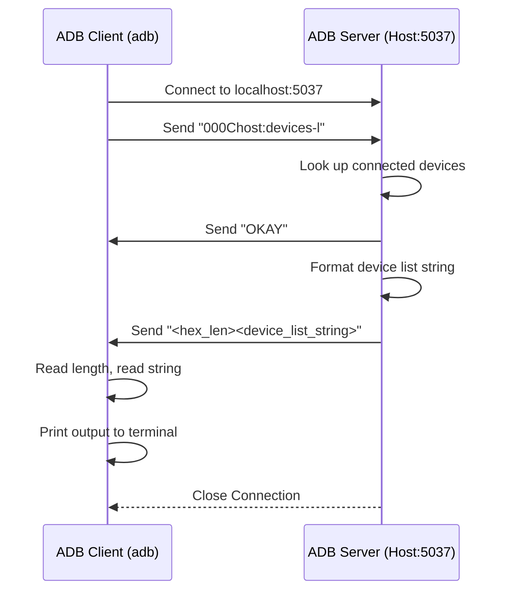
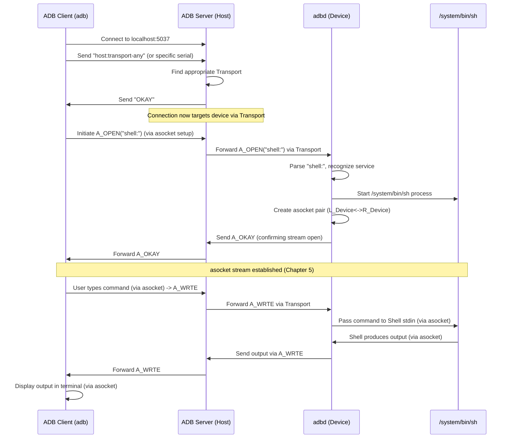

# Chapter 6: Services (Host/Local)

Welcome back! In [Chapter 5: Socket (`asocket`)](05_socket___asocket__.md), we saw how ADB uses `asocket` pairs to create logical communication streams (like phone calls) over a single main connection ([Transport (`atransport`)](02_transport___atransport__.md)). This allows running multiple commands like `adb shell` and `adb logcat` simultaneously.

But what are these different "calls" actually *requesting*? What specific jobs can the ADB system perform? That's where **Services** come in.

## Motivation: What Can ADB Actually Do?

Imagine the ADB system (Client, Server, Daemon) as a large organization. You, the user typing `adb` commands, need to request specific tasks. Sometimes you need information only the main office (ADB Server on your computer) has, like "How many employees (devices) are currently checked in?". Other times, you need to ask a specific branch office (the `adbd` daemon on a device) to do something, like "Go run the `ls` command in your local file room".

ADB **Services** are these specific tasks or actions you can request. The key difference lies in *who* handles the request: the main office (Host) or the branch office (Device/Local). Understanding this difference helps clarify how different `adb` commands work under the hood.

## Key Concepts

### 1. What is a Service?

In ADB terms, a **service** is simply a specific command or action that an ADB client can ask the ADB server or the device's `adbd` daemon to perform. Think of them as the names of the different departments or functions you can request within the ADB organization.

These service requests are typically sent as simple text strings, either:
*   Using the "smart socket" protocol between the `adb` client and the ADB server (e.g., `host:version`).
*   As the payload of an `A_OPEN` packet when establishing an [asocket](05_socket___asocket__.md) stream to the device (e.g., `shell:ls -l`).

### 2. Host Services: Handled by the Main Office

**Host services** are tasks handled *entirely* by the ADB server running on your host computer. They don't require communicating with an actual Android device.

*   **Who Handles It:** The ADB Server process on your PC/Mac/Linux machine.
*   **Example Use Cases:**
    *   Finding out the server's version (`adb version`).
    *   Getting a list of currently connected devices and their states (`adb devices`).
    *   Setting up port forwarding rules (`adb forward`).
    *   Stopping the ADB server (`adb kill-server`).
*   **How it's Requested:** Typically, the `adb` client sends a text command directly to the ADB server (listening on port 5037) using the "smart socket" protocol (see [Chapter 4: ADB Protocol & Messaging](04_adb_protocol___messaging.md) and `OVERVIEW.TXT`). The service name usually starts with `host:`.

    ```
    Client -> Server: "000Chost:version"  (Hex length + service name)
    Server -> Client: "OKAY"             (Acknowledgement)
    Server -> Client: "00040029"         (Hex length + version data)
    ```

*   **Analogy:** Asking the main office receptionist for the company directory or asking the IT department to configure network routing.

### 3. Local Services: Handled by the Branch Office (Device)

**Local services** are tasks handled by the `adbd` daemon running on the connected Android device or emulator. These requests need to be routed *through* the ADB server to the specific target device.

*   **Who Handles It:** The `adbd` process on the Android device/emulator.
*   **Example Use Cases:**
    *   Running a shell command (`adb shell ls`).
    *   Transferring files (`adb push`/`adb pull`).
    *   Rebooting the device (`adb reboot`).
    *   Getting device logs (`adb logcat`).
    *   Remounting filesystems (`adb remount`).
*   **How it's Requested:**
    1.  The `adb` client usually first tells the server *which* device to talk to (e.g., `host:transport:<serial>`).
    2.  Once the transport is switched, the client (via the server) sends an `A_OPEN` packet (from [Chapter 4](04_adb_protocol___messaging.md)) to the `adbd` daemon.
    3.  The *payload* of the `A_OPEN` packet contains the local service name string (e.g., `shell:`, `sync:`, `remount:`).
    4.  This sets up an [asocket](05_socket___asocket__.md) stream (Chapter 5) for communication with that specific service on the device.

*   **Analogy:** Asking the branch office manager to execute a task locally within that branch, like running a report or accessing a local file cabinet.

## How it Works: Requesting Services

Let's trace how requests for both types of services are handled.

### Requesting a Host Service (`adb devices`)

This involves only the client and the server on your host computer.

1.  **Client:** You type `adb devices`. The client formats this into a host service request string: `host:devices-l` (the `-l` gives more detail).
2.  **Client -> Server:** The client calculates the length (12 bytes -> "000C"), connects to `localhost:5037`, and sends the smart socket request: `000Chost:devices-l`.
3.  **Server:** The server receives the request. It sees the `host:` prefix and knows it should handle this itself. It calls its internal function to get the list of connected devices and their states.
4.  **Server -> Client (OKAY):** The server sends `OKAY` back to the client to acknowledge the request was valid.
5.  **Server -> Client (Data):** The server formats the device list into a single string (e.g., `emulator-5554\tdevice product:sdk_gphone_x86 model:sdk_gphone_x86 device:generic_x86\n`). It calculates the length (e.g., 100 bytes -> "0064") and sends the length followed by the data: `0064emulator-5554\tdevice...`.
6.  **Client:** The client receives the `OKAY`, reads the length (`0064`), reads that many bytes of data, prints the formatted list to your terminal, and the connection usually closes.



### Requesting a Local Service (`adb shell`)

This involves the client, server, and the device daemon (`adbd`).

1.  **Client:** You type `adb shell`. The client needs to tell the server to open a shell service on the target device.
2.  **Client -> Server (Switch Transport):** The client first sends a request to switch the connection focus to the correct device (e.g., `host:transport-any` if only one device is connected).
3.  **Server -> Client (OKAY):** The server finds the device's [Transport (`atransport`)](02_transport___atransport__.md) and sends `OKAY`. The connection is now effectively routed to that device's `adbd`.
4.  **Client -> Server -> Daemon (`A_OPEN`):** The client (via the server's transport) initiates the creation of an [asocket](05_socket___asocket__.md) stream by sending an `A_OPEN` packet.
    *   `command = A_OPEN`
    *   `arg0 = client_local_socket_id` (e.g., 1)
    *   `arg1 = 0`
    *   `payload = "shell:"` (The local service name!)
5.  **Daemon (`adbd`):** Receives the `A_OPEN` packet.
    *   Parses the payload `"shell:"`.
    *   Recognizes this as a request to start an interactive shell.
    *   Starts the `/system/bin/sh` process on the device.
    *   Sets up the [asocket](05_socket___asocket__.md) pair (local connected to the shell process, remote connected back to the transport) as described in Chapter 5. Assigns its own local ID (e.g., 5).
6.  **Daemon -> Server -> Client (`A_OKAY`):** `adbd` sends an `A_OKAY` packet back to confirm the stream is open.
    *   `command = A_OKAY`
    *   `arg0 = daemon_local_socket_id` (5)
    *   `arg1 = client_local_socket_id` (1)
7.  **Client/Server:** Receive the `A_OKAY`, completing the [asocket](05_socket___asocket__.md) setup.
8.  **Data Flow:** Now, data flows back and forth using `A_WRTE` packets over the established `asocket` stream, connected to your terminal on one end and the device's shell on the other.



## Code Walkthrough (Simplified)

Where are these services handled?

**1. Host Services (`adb_client.cpp`, server-side `adb.cpp`)**

The client often formats host requests directly.

```c++
// Simplified from client/adb_client.cpp - adb_query
bool adb_query(const std::string& service, std::string* result, std::string* error) {
    D("adb_query: %s", service.c_str()); // e.g., service = "host:version"

    // _adb_connect handles connecting to server & potentially switching transport
    unique_fd fd(_adb_connect(service, nullptr, error));
    if (fd < 0) {
        return false; // Failed to connect or server communication error
    }

    // If OKAY status received, read the result string sent by the server
    result->clear();
    if (!ReadProtocolString(fd.get(), result, error)) {
        // Failed to read the server's response data
        return false;
    }

    ReadOrderlyShutdown(fd.get()); // Wait for connection close
    return true;
}
```

*   This client function takes the service string (e.g., `host:devices`), connects to the server, sends the request, and reads the result. The server side (`adb.cpp` in the server component) has logic to parse strings starting with `host:` and call the appropriate function.

**2. Local Services (`daemon/services.cpp`, `adb.cpp` packet handling)**

On the device (`adbd`), when an `A_OPEN` packet arrives, the `handle_packet` function (in `adb.cpp`) delegates to service-specific handlers.

```c++
// Simplified logic within adbd's handle_packet for A_OPEN
void handle_packet(apacket *p, atransport *t)
{
    // ... other command cases ...
    case A_OPEN:
        // Extract the service name string from the packet payload
        std::string_view service_name(reinterpret_cast<char*>(p->payload.data()),
                                      p->msg.data_length);

        // Check if service name is known and okay to run
        if (/* service_name is valid and permitted */) {
            // Create the sockets for this new stream (local_socket connects to service)
            asocket* local_socket = create_local_service_socket(service_name, t);

            if (local_socket) {
                // Setup remote peer socket and link them (as in Chapter 5)
                asocket* remote_socket = create_remote_socket(local_socket->id, t);
                local_socket->peer = remote_socket;
                remote_socket->peer = local_socket;
                remote_socket->remote_id = p->msg.arg0; // Remember sender's ID

                // Send A_OKAY back to confirm stream is open
                send_ready(local_socket->id, remote_socket->remote_id, t);
                local_socket->ready(local_socket); // Allow service to start processing
            } else {
                // Failed to create service socket, send A_CLSE
                send_close(p->msg.arg0, 0, t);
            }
        } else {
            // Service not allowed or unknown, send A_CLSE
             send_close(p->msg.arg0, 0, t);
        }
        break; // End of A_OPEN case
    // ... other command cases ...
}

// Helper function (conceptual) that dispatches to the correct service handler
asocket* create_local_service_socket(std::string_view name, atransport* transport) {
    unique_fd service_fd;
    // Call daemon_service_to_fd to handle specific service strings
    service_fd = daemon_service_to_fd(name, transport);

    if (service_fd >= 0) {
        // If daemon_service_to_fd returned a valid FD, create a local socket around it
        return create_local_socket(std::move(service_fd));
    } else {
        // Maybe it's a service that returns an asocket directly? (e.g., track-jdwp)
        return daemon_service_to_socket(name);
        // If both return null/invalid, the service failed to start
    }
}
```

*   `handle_packet` receives the `A_OPEN`.
*   It extracts the service name (e.g., `"shell:"`, `"sync:"`) from the packet's payload.
*   It calls `create_local_service_socket` (a conceptual helper combining `daemon_service_to_fd` and `daemon_service_to_socket` from `daemon/services.cpp`).
*   `daemon_service_to_fd` is a large dispatcher function that looks at the service string (`name`) and starts the appropriate service (like `ShellService`, `file_sync_service`, `remount_service`, etc.), usually returning a file descriptor connected to that service.
*   The rest of the code sets up the [asocket](05_socket___asocket__.md) pair using this file descriptor, connecting the device-side service to the ADB transport stream.

You can explore the `SERVICES.TXT` file in the source code for a more comprehensive list of available host and local services.

## Conclusion

ADB services define the specific actions the ADB system can perform. They are divided into two main types:

*   **Host Services:** Handled locally by the ADB server on your computer (e.g., `host:devices`, `host:version`). Requested via the text-based smart socket protocol.
*   **Local Services:** Handled by the `adbd` daemon on the Android device (e.g., `shell:`, `sync:`, `reboot:`). Requested via `A_OPEN` packets containing the service name, setting up an [asocket](05_socket___asocket__.md) stream.

Understanding this distinction helps clarify which part of the ADB system is responsible for executing a given command. Many local services, like file transfer, have their own detailed protocols that run *over* the `asocket` stream.

**Next:** [Chapter 7: Sync Protocol](07_sync_protocol.md), where we'll dive into the specific protocol used by the `sync:` local service for file transfers.

---

Generated by [AI Codebase Knowledge Builder](https://github.com/The-Pocket/Tutorial-Codebase-Knowledge)