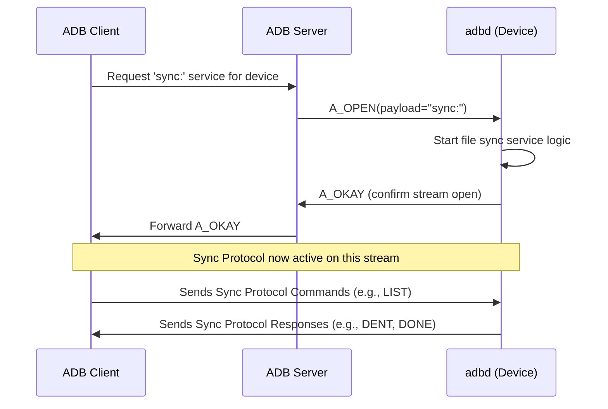
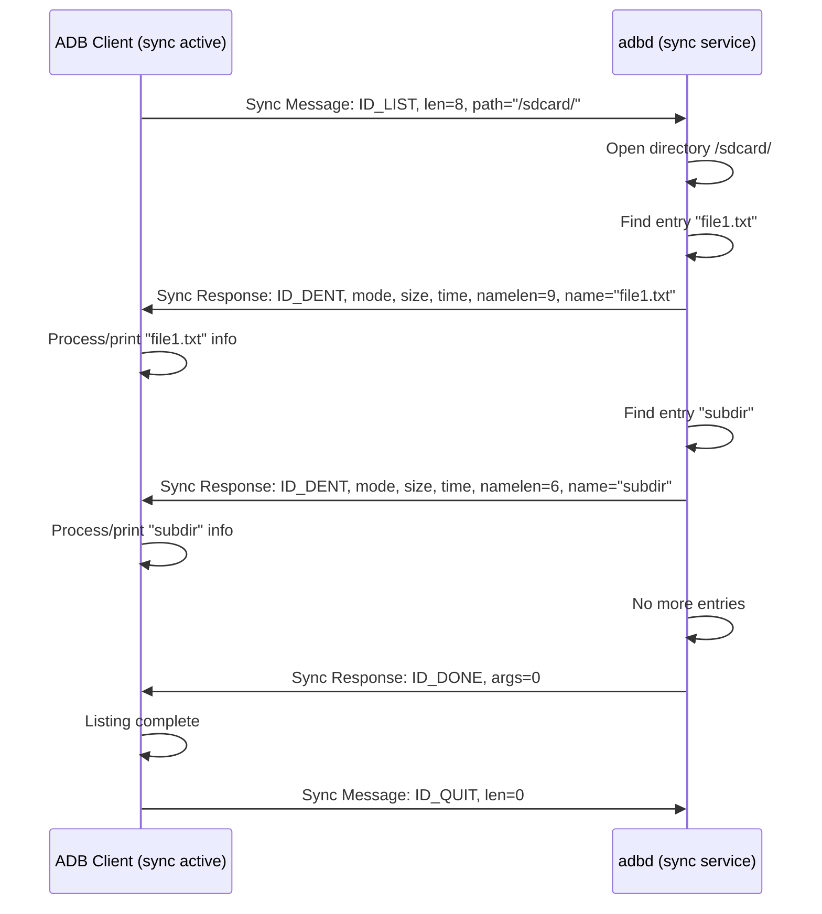

# Chapter 7: Sync Protocol

Welcome back! In [Chapter 6: Services (Host/Local)](06_services__host_local_.md), we learned about the different types of tasks ADB can perform, distinguishing between host services (handled by the server on your computer) and local services (handled by the `adbd` daemon on your device). One important local service we mentioned was `sync:`, used for file transfers.

Now, let's zoom in on how ADB actually moves files back and forth. It doesn't use the standard [ADB Protocol & Messaging](04_adb_protocol___messaging.md) commands like `A_WRTE` directly for file *content*. Instead, once the `sync:` service is started, it switches to a specialized language designed just for files: the **Sync Protocol**.

## Motivation: A Dedicated Courier for Files

Imagine the main ADB communication channel ([Transport (`atransport`)](02_transport___atransport__.md) and [Socket (`asocket`)](05_socket___asocket__.md)) is like a general postal service that can handle various messages. When you need to send or receive actual files, especially large ones, using the general service might be inefficient. You might need special procedures for packing the file data, handling file permissions, getting directory listings, and confirming delivery.

The **Sync Protocol** is like a dedicated courier service within the ADB system. Once you tell ADB you want to do a file operation (by requesting the `sync:` service), this specialized courier takes over the communication channel (`asocket`). It uses its own set of unique commands and package formats, optimized specifically for tasks like:

*   Copying files *to* the device (`adb push`)
*   Copying files *from* the device (`adb pull`)
*   Listing directories on the device (`adb ls`)
*   Getting file information (like size and modification time)

This specialized protocol ensures files are transferred efficiently and reliably.

## Key Concepts

### 1. It's a Binary Protocol

Unlike some other parts of ADB that might use text (like the initial client-server handshake), the Sync Protocol is purely **binary**. This means it sends data as sequences of bytes that have specific meanings based on their position and value, rather than human-readable text characters. This is generally more efficient for transferring raw file data.

### 2. Activation: The `sync:` Service

The Sync Protocol doesn't run all the time. It only becomes active *after* the ADB client successfully requests the `sync:` service from the `adbd` daemon on the device using an `A_OPEN` packet, establishing an [asocket](05_socket___asocket__.md) stream specifically for file operations.



Once the `OKAY` is received for the `sync:` service, the communication over that `asocket` switches from the standard ADB packet protocol to the Sync Protocol.

### 3. Message Format: ID + Length + Data

Messages in the Sync Protocol generally follow a simple structure:

1.  **Command ID (4 bytes):** A unique 4-character code identifying the command or response (e.g., `LIST`, `SEND`, `DATA`, `DONE`). These are often defined using a macro like `MKID('L', 'I', 'S', 'T')`.
2.  **Length/Argument (4 bytes):** A 32-bit number whose meaning depends on the Command ID.
    *   For requests like `LIST`, `SEND`, `RECV`, `STAT`, this is the **length of the file path** that follows immediately.
    *   For `DATA` messages, this is the **length of the file data chunk** that follows.
    *   For `DONE` messages during a file send, this might be the **modification time** of the file.
    *   For responses like `DENT`, this number can represent file **mode**, **size**, **time**, or **name length**, depending on the specific response structure.
3.  **Payload (Variable):** Optional data that follows the first 8 bytes.
    *   For requests, this is usually the file path string (whose length was given in the previous field).
    *   For `DATA` messages, this is the actual chunk of file content.
    *   For `DENT` messages, this is the filename string.
    *   For `FAIL` messages, this might be an error message string.

### 4. The Commands: The Courier's Instruction Set

Here are some of the most important Sync Protocol commands (defined in `file_sync_protocol.h`):

*   **Requests (Client -> Device):**
    *   `ID_LIST`: Asks the device to list the contents of a directory. The path follows.
    *   `ID_SEND`: Tells the device the client wants to send a file. The path and mode follow. The client then sends `ID_DATA` chunks and finishes with `ID_DONE`.
    *   `ID_RECV`: Asks the device to send a file *to* the client. The path follows. The device responds with `ID_DATA` chunks and finishes with `ID_DONE`.
    *   `ID_STAT_V2` / `ID_LSTAT_V2`: Asks for detailed metadata about a file or symbolic link (using `stat` or `lstat`). The path follows. (V1 existed but is less common now).
    *   `ID_QUIT`: Tells the device the sync session is over. The `asocket` connection is then closed.

*   **Responses (Device -> Client):**
    *   `ID_DENT`: A directory entry response (used with `ID_LIST`). Contains metadata (mode, size, time, name length) followed by the filename. Multiple `ID_DENT` messages can be sent for one `ID_LIST` request.
    *   `ID_DATA`: A chunk of file data (used with `ID_RECV` or `ID_SEND`). The length field specifies the size of the chunk, followed by the actual file bytes. Max chunk size is typically 64KB (`SYNC_DATA_MAX`).
    *   `ID_DONE`: Signals the completion of a list (`ID_LIST`) or a file transfer (`ID_RECV`, `ID_SEND`).
    *   `ID_STAT_V2` / `ID_LSTAT_V2`: The response to a stat request, containing detailed file metadata or an error code.
    *   `ID_OKAY`: A simple success confirmation, often sent after a successful `ID_SEND` operation is `DONE`.
    *   `ID_FAIL`: Indicates an error occurred. The length field specifies the size of the error message string that follows.

Think of these like specific forms and labels the courier uses for different types of packages and requests.

## How it Works: Listing a Directory (`adb ls /sdcard/`)

Let's trace the simplified flow when you run `adb ls /sdcard/` (which uses the `sync:` service):

1.  **Setup:** The `adb` client asks the server, which asks the `adbd` daemon to start the `sync:` service. An `asocket` stream is established, dedicated to sync operations. (Covered in [Chapter 5](05_socket___asocket__.md) and [Chapter 6](06_services__host_local_.md)).
2.  **Client Sends `LIST` Request:** The client sends a Sync Protocol message over the established `asocket`:
    *   **ID:** `ID_LIST` (4 bytes: `'L','I','S','T'`)
    *   **Length:** 8 (4 bytes: the length of "/sdcard/")
    *   **Payload:** "/sdcard/" (8 bytes: the actual path string)
3.  **Device Processes `LIST`:** The `adbd` sync service receives the request. It opens the `/sdcard/` directory.
4.  **Device Sends `DENT` for Each Entry:** For *each* file or directory inside `/sdcard/` (let's say it finds "file1.txt" and "subdir"):
    *   It gets the entry's metadata (mode, size, modification time).
    *   It sends an `ID_DENT` message back to the client.
        *   Example for "file1.txt":
            *   **ID:** `ID_DENT` (4 bytes)
            *   **Mode:** (4 bytes, e.g., file permissions)
            *   **Size:** (4 bytes, file size in bytes)
            *   **Time:** (4 bytes, modification timestamp)
            *   **Name Length:** 9 (4 bytes, length of "file1.txt")
            *   **Payload:** "file1.txt" (9 bytes)
        *   Example for "subdir":
            *   **ID:** `ID_DENT` (4 bytes)
            *   **Mode:** (4 bytes, directory permissions)
            *   **Size:** (4 bytes, typically 0 or 4096 for dirs)
            *   **Time:** (4 bytes, modification timestamp)
            *   **Name Length:** 6 (4 bytes, length of "subdir")
            *   **Payload:** "subdir" (6 bytes)
5.  **Client Receives `DENT`s:** The client reads each `ID_DENT` message, extracts the metadata and filename, and typically prints it to the console.
6.  **Device Sends `DONE`:** Once `adbd` has sent `ID_DENT` messages for all entries in `/sdcard/`, it sends a final message:
    *   **ID:** `ID_DONE` (4 bytes)
    *   **Length/Args:** (4 bytes, usually 0 for LIST's DONE)
7.  **Client Receives `DONE`:** The client sees the `ID_DONE` and knows the directory listing is complete.
8.  **Client Sends `QUIT` (Optional but typical):** The client might send `ID_QUIT` to close the sync session cleanly.



File transfers (`adb push`/`adb pull`) work similarly but use `ID_SEND`/`ID_RECV` to initiate, followed by multiple `ID_DATA` chunks containing the file content, and finally an `ID_DONE` to signal completion.

## Code Walkthrough (Simplified)

Let's look at where these IDs and structures are defined and used.

**1. Defining the IDs (`file_sync_protocol.h`)**

This header file defines the 4-byte command IDs using the `MKID` macro.

```c++
// Simplified from file_sync_protocol.h

// Macro to create a 4-byte ID from 4 characters
#define MKID(a, b, c, d) ((a) | ((b) << 8) | ((c) << 16) | ((d) << 24))

// Define the command IDs
#define ID_LSTAT_V1 MKID('S', 'T', 'A', 'T') // Older stat
#define ID_STAT_V2  MKID('S', 'T', 'A', '2') // Stat (follow symlinks)
#define ID_LSTAT_V2 MKID('L', 'S', 'T', '2') // LStat (don't follow symlinks)
#define ID_LIST     MKID('L', 'I', 'S', 'T') // List directory
#define ID_SEND     MKID('S', 'E', 'N', 'D') // Initiate file send to device
#define ID_RECV     MKID('R', 'E', 'C', 'V') // Initiate file receive from device
#define ID_DENT     MKID('D', 'E', 'N', 'T') // Directory entry response
#define ID_DONE     MKID('D', 'O', 'N', 'E') // Operation complete
#define ID_DATA     MKID('D', 'A', 'T', 'A') // File data chunk
#define ID_OKAY     MKID('O', 'K', 'A', 'Y') // Success confirmation
#define ID_FAIL     MKID('F', 'A', 'I', 'L') // Failure notification
#define ID_QUIT     MKID('Q', 'U', 'I', 'T') // End sync session

// Max size for a single ID_DATA chunk
#define SYNC_DATA_MAX (64 * 1024)
```

*   This clearly defines the "vocabulary" of the Sync Protocol using memorable 4-character codes packed into 32-bit integers.

**2. The Request Structure (`file_sync_protocol.h`)**

This structure represents the initial part of many sync *requests* (like `LIST`, `SEND`, `RECV`, `STAT`).

```c++
// Simplified from file_sync_protocol.h

// Structure for the initial request message part (8 bytes)
struct SyncRequest {
    uint32_t id;           // Command ID (e.g., ID_LIST, ID_SEND)
    uint32_t path_length;  // Length of the file/directory path that follows
    // The actual path string (of size 'path_length') comes immediately after
    // this structure in the data stream. It's *not* null-terminated.
} __attribute__((packed)); // Ensure no padding bytes are added by the compiler
```

*   When the client wants to list `/sdcard/`, it sends this `SyncRequest` struct with `id = ID_LIST` and `path_length = 8`, immediately followed by the 8 bytes of the string `/sdcard/`.

**3. Device Handling `LIST` (`daemon/file_sync_service.cpp`)**

This function on the device handles an incoming `ID_LIST` request.

```c++
// Simplified from daemon/file_sync_service.cpp - do_list

// 's' is the file descriptor for the asocket connection
// 'path' is the directory path received from the client (e.g., "/sdcard/")
static bool do_list(int s, const char* path) {
    // Structure to hold directory entry info for the response
    struct DirectoryEntryResponse { // Simplified representation of syncmsg.dent
         uint32_t id;       // ID_DENT
         uint32_t mode;
         uint32_t size;
         uint32_t time;
         uint32_t namelen;
    } dent_msg;
    dent_msg.id = ID_DENT; // Set the response ID

    // Open the directory
    std::unique_ptr<DIR, int(*)(DIR*)> d(opendir(path), closedir);
    if (!d) goto done; // Go to send ID_DONE if directory can't be opened

    dirent* de;
    // Loop through directory entries
    while ((de = readdir(d.get()))) {
        // Construct full path to get file stats
        std::string filename = std::string(path) + "/" + de->d_name;
        struct stat st; // Structure to hold file stats

        // Get stats (use lstat to not follow symlinks for listing)
        if (lstat(filename.c_str(), &st) == 0) {
            size_t d_name_length = strlen(de->d_name);
            // Fill in the response structure
            dent_msg.mode = st.st_mode;
            dent_msg.size = st.st_size;
            dent_msg.time = st.st_mtime;
            dent_msg.namelen = d_name_length;

            // Send the DENT structure (fixed size part)
            if (!WriteFdExactly(s, &dent_msg, sizeof(dent_msg))) return false; // Error
            // Send the filename string (variable size part)
            if (!WriteFdExactly(s, de->d_name, d_name_length)) return false; // Error
        }
    }
    // Finished reading directory entries

done:
    // Send the final ID_DONE message
    dent_msg.id = ID_DONE;
    dent_msg.mode = 0;
    dent_msg.size = 0;
    dent_msg.time = 0;
    dent_msg.namelen = 0;
    return WriteFdExactly(s, &dent_msg, sizeof(dent_msg)); // Send the DONE message
}
```

*   This code opens the requested directory, iterates through its contents, gets stats for each item, and sends back an `ID_DENT` message (header + filename) for each one. Finally, it sends an `ID_DONE` message. `WriteFdExactly` is a helper function to ensure all bytes are sent over the connection (`s`).

**4. Client Receiving List Entries (`client/file_sync_client.cpp`)**

This function on the client side sends the `LIST` request and processes the `DENT` and `DONE` responses.

```c++
// Simplified from client/file_sync_client.cpp - sync_ls

// Callback type: a function to call for each received directory entry
typedef void (*sync_ls_cb)(unsigned mode, unsigned size, unsigned time, const char* name);

// 'sc' is the SyncConnection object managing the connection
// 'path' is the directory to list (e.g., "/sdcard/")
// 'func' is the callback function to process each entry
static bool sync_ls(SyncConnection& sc, const char* path, sync_ls_cb func) {
    // 1. Send the LIST request
    if (!sc.SendRequest(ID_LIST, path)) {
        sc.Error("Failed to send LIST request for %s", path);
        return false;
    }

    // Structure to read the DENT response header
    struct DentResponseHeader { // Simplified syncmsg.dent
        uint32_t id;
        uint32_t mode;
        uint32_t size;
        uint32_t time;
        uint32_t namelen;
    } dent_header;

    // 2. Loop to receive responses
    while (true) {
        // Read the fixed-size header part of the response
        if (!ReadFdExactly(sc.fd.get(), &dent_header, sizeof(dent_header))) {
            sc.Error("Failed to read sync response header");
            return false;
        }

        // Check if this is the end marker
        if (dent_header.id == ID_DONE) {
            return true; // Successfully received all entries
        }

        // Must be a directory entry
        if (dent_header.id != ID_DENT) {
            sc.Error("Expected ID_DENT or ID_DONE, got %x", dent_header.id);
            return false; // Protocol error
        }

        size_t len = dent_header.namelen;
        if (len > 1024) { // Safety check
             sc.Error("Filename too long: %zu", len);
             return false;
        }

        // Buffer to read the filename
        char name_buffer[1025];
        // Read the filename string itself
        if (!ReadFdExactly(sc.fd.get(), name_buffer, len)) {
             sc.Error("Failed to read filename string");
             return false;
        }
        name_buffer[len] = 0; // Null-terminate the string

        // Call the provided callback function with the received info
        func(dent_header.mode, dent_header.size, dent_header.time, name_buffer);
    }
}
```

*   This client code first sends the `ID_LIST` request using `sc.SendRequest`. Then, it enters a loop, reading the fixed-size header of the response (`DentResponseHeader`). If the ID is `ID_DONE`, the loop finishes. If it's `ID_DENT`, it reads the filename (based on `namelen`) and calls the callback function `func` to process the entry (e.g., print it).

## Conclusion

The Sync Protocol is ADB's specialized language for efficient file operations. It activates after the `sync:` service request and uses a binary format with specific command IDs (`LIST`, `SEND`, `RECV`, `DATA`, `DENT`, `DONE`, `STAT`, `FAIL`, `QUIT`) to manage directory listing, file metadata retrieval, and the transfer of file content in chunks. Think of it as the dedicated courier service ensuring your files get where they need to go within the ADB system.

Understanding this protocol helps clarify how commands like `adb push`, `adb pull`, and `adb ls` work under the hood after the initial connection setup.

Now that we've seen how files are handled, let's look at another common ADB task: running commands remotely.

**Next:** [Chapter 8: Shell Protocol (`shell_v2`)](08_shell_protocol___shell_v2__.md)

---

Generated by [AI Codebase Knowledge Builder](https://github.com/The-Pocket/Tutorial-Codebase-Knowledge)