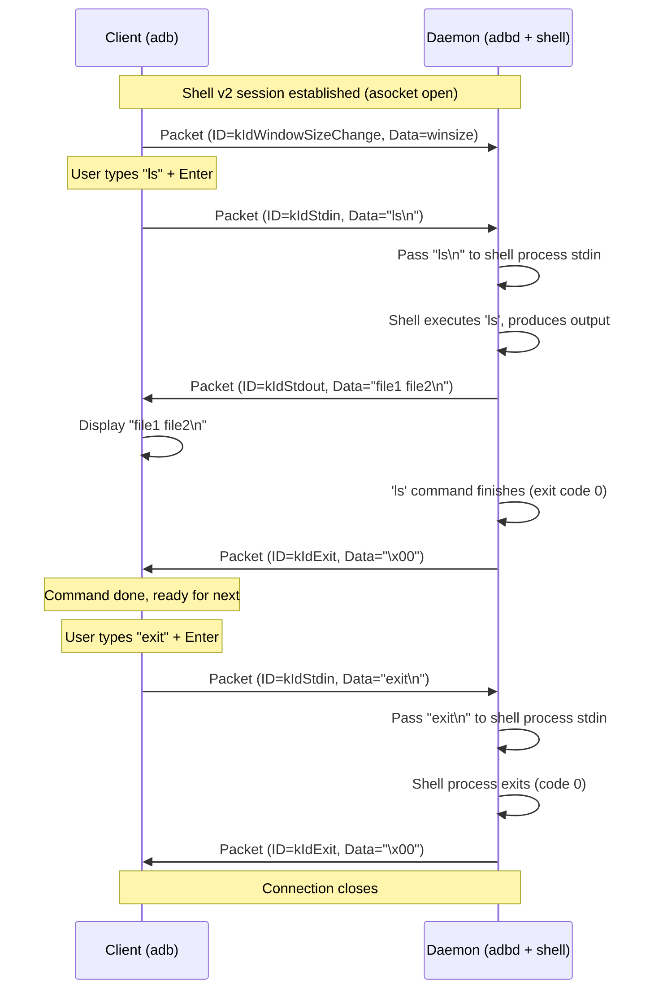

# Chapter 8: Shell Protocol (`shell_v2`)

Welcome back! In [Chapter 7: Sync Protocol](07_sync_protocol.md), we explored the specialized language ADB uses for file transfers (`adb push/pull`). Now, let's look at another common and important task: running commands on the device using `adb shell`.

While the `shell:` service itself was covered in [Chapter 6: Services (Host/Local)](06_services__host_local_.md), the *way* data is exchanged for interactive shells has been improved significantly with the **Shell Protocol (version 2)**, often called `shell_v2`.

## Motivation: Cleaning Up the Shell Conversation

Imagine using the original `adb shell`. It worked, but it was a bit like using a simple walkie-talkie:

*   **Everything Mixed:** The command's normal output (stdout) and any error messages (stderr) were broadcast over the same channel, all mixed together. It was hard to tell which was which.
*   **No "Command Finished" Signal:** You couldn't easily tell if the command you ran on the device actually succeeded or failed. Did it finish with exit code 0 (success) or 1 (error)? The walkie-talkie just went silent.
*   **No Window Size Info:** If you resized your terminal window on your computer, the shell running on the device wouldn't know about it, potentially messing up the layout of text-based applications.

This made scripting with `adb shell` tricky and less robust. We needed a better way!

**`shell_v2` is the upgrade.** It's like switching from that basic walkie-talkie to a full conference call system:

*   **Separate Channels:** It provides distinct virtual channels for standard input (stdin), standard output (stdout), and standard error (stderr).
*   **Control Signals:** It allows sending control information, like the final **exit code** of the remote command and **window size changes**.

This makes `adb shell` much more powerful and reliable, especially for automation and interactive programs.

## Key Concepts

### 1. Built on `asocket`

Like the Sync Protocol, `shell_v2` doesn't replace the underlying communication mechanism. It runs *on top* of the [asocket](05_socket___asocket__.md) stream established when the `shell:` service is requested via an `A_OPEN` packet ([Chapter 4](04_adb_protocol___messaging.md)).

### 2. Multiplexing with Packets

The core idea is **multiplexing** – sending different kinds of information over the single `asocket` channel. How? By wrapping each piece of data in a small packet with a specific header.

### 3. The Packet Format

`shell_v2` uses a very simple packet structure:

```
+--------+----------------+--------------------+
| ID (1) | Length (4)     | Data (Length bytes)|
+--------+----------------+--------------------+
```

1.  **ID (1 byte):** A single byte indicating the *type* of data in the packet (e.g., Is this stdin data? Stdout data? An exit code?).
2.  **Length (4 bytes):** A 32-bit number telling the receiver how many bytes of actual `Data` follow this header.
3.  **Data (Variable):** The actual payload bytes (e.g., the characters you typed, the output from the command, the exit code).

### 4. Packet IDs (`ShellProtocol::Id`)

The crucial `ID` byte tells the receiver how to interpret the `Data`. The main IDs are defined in `shell_protocol.h`:

*   `kIdStdin (0)`: Contains data being sent *from* the client (your computer) *to* the shell process's standard input on the device. (e.g., the `ls -l` command you typed).
*   `kIdStdout (1)`: Contains data from the shell process's standard output *on the device*, being sent back *to* the client. (e.g., the directory listing from `ls -l`).
*   `kIdStderr (2)`: Contains data from the shell process's standard error stream *on the device*, being sent back *to* the client. (e.g., an error message like "file not found").
*   `kIdExit (3)`: Contains the final exit code (usually 1 byte) of the shell command after it finishes on the device. Sent from device to client.
*   `kIdCloseStdin (4)`: A signal from the client to the device telling it that no more stdin data will be sent (like closing the input pipe).
*   `kIdWindowSizeChange (5)`: Contains information about the client's terminal window size (rows, columns, pixels). Sent from client to device, usually when the terminal is resized.

By using these different IDs, `shell_v2` keeps the different streams logically separate even though they travel over the same `asocket` connection.

## How it Works: An Interactive Shell Session (`adb shell`)

Let's trace a simplified interactive `adb shell` session using `shell_v2`:

1.  **Setup:** Client requests `shell:` service, `adbd` starts `/system/bin/sh` (or similar), and the `asocket` stream is established. Both sides agree to use `shell_v2` (this negotiation happens during service startup, often based on device feature flags).
2.  **Client Sends Window Size:** The client might immediately send a `kIdWindowSizeChange` packet with the current terminal dimensions.
    *   Client -> Device: Packet (ID=5, Len=N, Data="<rows>x<cols>,<xpixels>x<ypixels>")
3.  **Client Sends Command:** You type `ls` and press Enter. The client sends this as stdin data.
    *   Client -> Device: Packet (ID=0, Len=3, Data="ls\n")
4.  **Device Shell Executes:** `adbd` receives the `kIdStdin` packet, extracts "ls\n", and writes it to the standard input of the `/system/bin/sh` process. The shell runs the command.
5.  **Device Sends Output:** The shell produces output (e.g., "file1 file2\n"). `adbd` reads this from the shell's standard output. It wraps this output in `kIdStdout` packets and sends them back. (It might be split into multiple packets if the output is large).
    *   Device -> Client: Packet (ID=1, Len=13, Data="file1 file2\n")
6.  **Client Displays Output:** The client receives the `kIdStdout` packet and displays "file1 file2\n" in your terminal.
7.  **Device Sends Exit Code:** The `ls` command finishes (usually with exit code 0). `adbd` detects this. It sends the exit code back to the client.
    *   Device -> Client: Packet (ID=3, Len=1, Data="\x00") (Data is the single byte exit code 0)
8.  **Client Acknowledges Exit (Implicitly):** The client receives the exit code. If the shell was started non-interactively (`adb shell ls`), the client would now typically close the connection. In an interactive session, it just means the command finished, and the shell prompt is likely ready for the next command.
9.  **Client Sends `exit`:** You type `exit` and press Enter.
    *   Client -> Device: Packet (ID=0, Len=5, Data="exit\n")
10. **Device Shell Exits:** `adbd` passes "exit\n" to the shell. The shell process terminates (e.g., with exit code 0).
11. **Device Sends Final Exit Code:** `adbd` detects the shell *process* exited.
    *   Device -> Client: Packet (ID=3, Len=1, Data="\x00")
12. **Connection Closes:** Both sides close the `asocket` stream.



This clear separation using packet IDs makes the interaction much cleaner than the old raw mode.

## Code Walkthrough (Simplified)

Let's see how this protocol is represented and used in the code.

**1. Protocol Definition (`shell_protocol.h`)**

This header defines the packet IDs and the `ShellProtocol` class helper.

```c++
// Simplified from shell_protocol.h

#include <stdint.h>
#include "adb_unique_fd.h" // For borrowed_fd

// The different packet type identifiers
enum Id : uint8_t {
    kIdStdin = 0,
    kIdStdout = 1,
    kIdStderr = 2,
    kIdExit = 3,
    kIdCloseStdin = 4,
    kIdWindowSizeChange = 5,
    kIdInvalid = 255,
};

// Helper class to read/write shell_v2 packets
class ShellProtocol {
  public:
    explicit ShellProtocol(borrowed_fd fd); // Takes the asocket FD
    virtual ~ShellProtocol();

    // Reads one complete packet header + payload chunk
    bool Read();
    // Writes one packet (ID + Length + Data)
    bool Write(Id id, size_t length);

    // Accessors after Read()
    int id() const;          // Get the ID of the packet just read
    size_t data_length() const; // Get payload length of packet read
    const char* data() const; // Get pointer to payload data read
    char* data();            // Get pointer to write buffer

    // Max payload size for one packet
    size_t data_capacity() const;

  private:
    typedef uint32_t length_t; // Length is 4 bytes
    enum {
        kHeaderSize = sizeof(Id) + sizeof(length_t) // Header is 1 + 4 = 5 bytes
    };
    // ... internal buffer members ...
    borrowed_fd fd_;
    char buffer_[/* MAX_PAYLOAD size */];
    size_t data_length_ = 0, bytes_left_ = 0; // For handling large packets split across reads
};
```

*   This defines the packet `Id`s we discussed.
*   The `ShellProtocol` class provides methods to easily `Read()` and `Write()` packets in the correct format over the underlying file descriptor (`fd`) associated with the `asocket`.

**2. Writing a Packet (`shell_service_protocol.cpp`)**

Here's how the `ShellProtocol::Write` method constructs and sends a packet:

```c++
// Simplified from shell_service_protocol.cpp

#include "shell_protocol.h"
#include "adb_io.h" // For WriteFdExactly
#include <string.h> // For memcpy

bool ShellProtocol::Write(Id id, size_t length) {
    // 1. Write the ID (1 byte) into the internal buffer
    buffer_[0] = id;

    // 2. Write the Length (4 bytes) into the buffer
    length_t typed_length = length; // Ensure it's uint32_t
    memcpy(&buffer_[1], &typed_length, sizeof(typed_length));

    // 3. Send the header (5 bytes) plus the actual data
    //    (which is assumed to already be in buffer_ + kHeaderSize)
    //    over the file descriptor using a reliable write helper.
    return WriteFdExactly(fd_, buffer_, kHeaderSize + length);
}
```

*   This code takes the desired `id` and the `length` of the data (which should already be placed in `buffer_ + kHeaderSize` by the caller).
*   It puts the `id` and `length` into the first 5 bytes of the `buffer_`.
*   It then calls `WriteFdExactly` to send the 5-byte header *and* the `length` bytes of payload data all at once over the `fd_`.

**3. Reading a Packet (`shell_service_protocol.cpp`)**

The `ShellProtocol::Read` method reads the header, then the payload:

```c++
// Simplified from shell_service_protocol.cpp

#include "shell_protocol.h"
#include "adb_io.h" // For ReadFdExactly
#include <string.h> // For memcpy
#include <algorithm> // For std::min

bool ShellProtocol::Read() {
    // Only read a new header if we've finished the previous packet's payload
    if (!bytes_left_) {
        // 1. Read the 5-byte header (ID + Length)
        if (!ReadFdExactly(fd_, buffer_, kHeaderSize)) {
            return false; // Error or EOF reading header
        }

        // 2. Extract the payload length from the header
        length_t packet_length;
        memcpy(&packet_length, &buffer_[1], sizeof(packet_length));
        bytes_left_ = packet_length; // Remember total payload bytes expected
        data_length_ = 0;            // Reset current payload chunk size
    }

    // 3. Read the payload chunk (up to buffer capacity)
    //    If packet_length > capacity, this reads only the first chunk.
    size_t read_length = std::min(bytes_left_, data_capacity());
    if (read_length > 0) {
         // Read payload into buffer_ + kHeaderSize
         if (!ReadFdExactly(fd_, data(), read_length)) {
             return false; // Error or EOF reading payload
         }
    }

    // 4. Update state
    bytes_left_ -= read_length; // Decrease remaining expected bytes
    data_length_ = read_length; // Store size of *this* chunk

    // Returns true if header + (part of) payload read successfully
    return true;
    // Caller checks id() and data() after this returns true.
    // If bytes_left_ > 0, caller needs to call Read() again for next chunk.
}
```

*   This function first reads the 5-byte header (`ID` and `Length`).
*   It stores the expected total payload size (`packet_length`) in `bytes_left_`.
*   It then tries to read a chunk of the payload (up to `data_capacity()`) into the buffer starting at `data()`.
*   It updates `bytes_left_` and `data_length_`. If the original `packet_length` was larger than the buffer, `bytes_left_` will still be positive, and the caller needs to call `Read()` again to get the next chunk of the same logical packet.

**4. Using the Protocol (`daemon/shell_service.cpp`)**

The shell service code on the device (`adbd`) uses `ShellProtocol` to communicate with the client.

```c++
// Simplified concept from daemon/shell_service.cpp (Subprocess::PassOutput)

// Reads data from the actual shell process's stdout/stderr FD ('sfd')
// and sends it to the client wrapped in a shell_v2 packet.
// 'output_' is the ShellProtocol object for writing to the client.
// 'id' is kIdStdout or kIdStderr.
unique_fd* Subprocess::PassOutput(unique_fd* sfd, ShellProtocol::Id id) {
    // Read directly from the shell's pipe into the protocol buffer's data section
    int bytes = adb_read(*sfd, output_->data(), output_->data_capacity());

    // Error or EOF from shell process?
    if (bytes <= 0) {
        // ... handle error or clean close ...
        return sfd; // Return the FD that died
    }

    // Successfully read 'bytes' from shell. Now write packet to client.
    if (!output_->Write(id, bytes)) {
        // Error writing to client socket
        // ... handle error ...
        return &protocol_sfd_; // Return the protocol FD as having died
    }

    return nullptr; // Success, no FD died
}

// Simplified concept from daemon/shell_service.cpp (Subprocess::PassInput)

// Reads a packet from the client ('input_') and writes kIdStdin data
// to the actual shell process's stdin FD ('stdinout_sfd_').
unique_fd* Subprocess::PassInput() {
    // Read a packet (or next chunk) from the client
    if (!input_->Read()) {
        // Error reading from client socket
        // ... handle error ...
        return &protocol_sfd_; // Protocol FD died
    }

    // Check the packet type
    if (input_->id() == ShellProtocol::kIdStdin) {
        // Write the received data to the shell process's stdin
        if (!WriteFdExactly(stdinout_sfd_, input_->data(), input_->data_length())) {
             // Error writing to shell process
             // ... handle error ...
             return &stdinout_sfd_; // Shell stdin FD died
        }
    } else if (input_->id() == ShellProtocol::kIdWindowSizeChange) {
        // ... handle window size change message ...
    } else if (input_->id() == ShellProtocol::kIdCloseStdin) {
        // ... handle close stdin message ...
    }
    // Ignore other packet types for simplicity

    return nullptr; // Success
}

// Simplified concept from daemon/shell_service.cpp (Subprocess::WaitForExit)

void Subprocess::WaitForExit() {
    int exit_code = 1; // Default error
    pid_t shell_pid = /* pid of the shell process */;

    // ... wait for the shell process to exit using waitpid ...
    // ... determine the actual exit_code from waitpid status ...

    // If we have an open protocol connection, send the exit code
    if (protocol_sfd_ != -1) {
        // Put the single exit code byte into the data buffer
        output_->data()[0] = static_cast<char>(exit_code);
        // Send the exit packet (ID=kIdExit, Length=1)
        if (!output_->Write(ShellProtocol::kIdExit, 1)) {
            // Error sending exit code
        }
        protocol_sfd_.reset(-1); // Close connection after sending exit code
    }
}
```

*   `PassOutput`: Reads raw bytes from the shell process's stdout/stderr and uses `output_->Write()` to wrap them in `kIdStdout`/`kIdStderr` packets before sending to the client.
*   `PassInput`: Uses `input_->Read()` to get packets from the client. If it's `kIdStdin`, it writes the payload to the shell process's stdin. It can also handle `kIdWindowSizeChange`, etc.
*   `WaitForExit`: After the shell process terminates, it uses `output_->Write()` to send a final `kIdExit` packet containing the 1-byte exit code.

## Conclusion

The Shell Protocol (`shell_v2`) is a significant enhancement over the original raw `adb shell` communication. By using a simple packet structure (ID + Length + Data), it allows ADB to:

*   Reliably separate stdout and stderr streams.
*   Pass the final exit code of the remote command back to the client.
*   Handle terminal window size changes for a better interactive experience.

It achieves this multiplexing over the standard `shell:` service [asocket](05_socket___asocket__.md) stream, making `adb shell` much more robust and usable for both interactive sessions and scripting. It's the "conference call system" upgrade that makes remote shell access much cleaner.

Now that we've covered the major protocols and services, how does ADB manage all these connections and data flows efficiently without blocking? That's the role of the event loop.

**Next:** [Chapter 9: Event Loop (`fdevent`)](09_event_loop___fdevent__.md)

---

Generated by [AI Codebase Knowledge Builder](https://github.com/The-Pocket/Tutorial-Codebase-Knowledge)