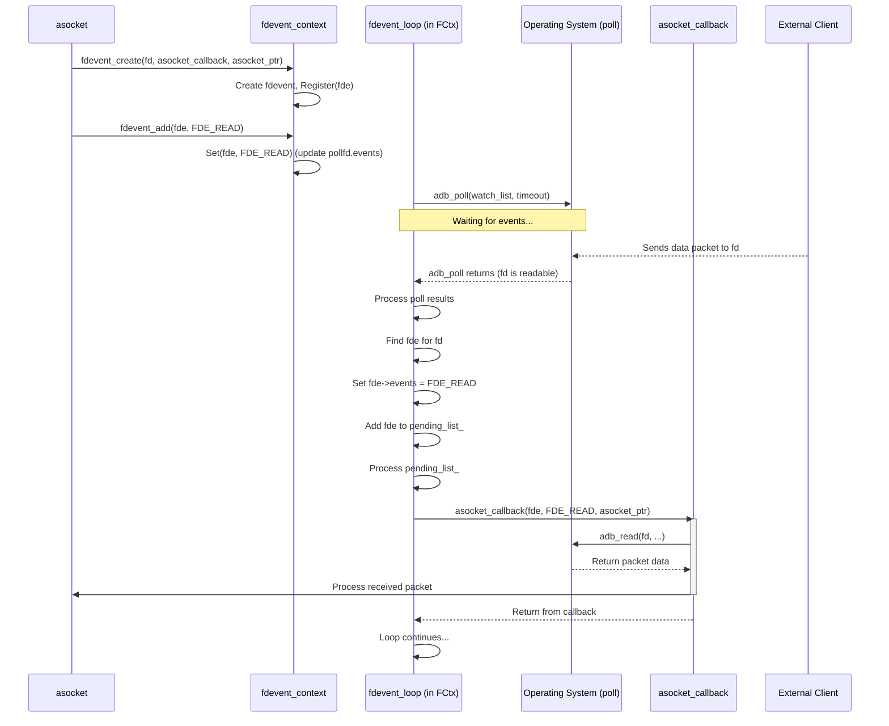

# Chapter 9: Event Loop (`fdevent`)

Welcome to the final chapter of our `adb_codebase` core concepts tour! In [Chapter 8: Shell Protocol (`shell_v2`)](08_shell_protocol___shell_v2__.md), we saw how ADB manages shell communication cleanly using a packet-based protocol on top of an [asocket](05_socket___asocket__.md) stream. We've seen how ADB sets up connections ([Chapter 1](01_connection___connection___blockingconnection__.md)), manages transports ([Chapter 2](02_transport___atransport__.md)), authenticates ([Chapter 3](03_authentication___adb_auth__.md)), uses a standard message format ([Chapter 4](04_adb_protocol___messaging.md)), creates logical streams ([Chapter 5](05_socket___asocket__.md)), and runs specific services ([Chapter 6](06_services__host_local_.md), [Chapter 7](07_sync_protocol.md), [Chapter 8](08_shell_protocol___shell_v2__.md)).

But how does the ADB server (or daemon) juggle all these things *at the same time*? How can it listen for new USB devices, handle incoming commands from multiple `adb` clients, and manage data streams for `shell` and `logcat` sessions concurrently, all without getting stuck waiting for one specific thing?

## Motivation: The Efficient Secretary

Imagine you're a very busy secretary in an office (the ADB server). You have multiple responsibilities:
*   Answering the main phone line for incoming calls (new `adb` client connections).
*   Monitoring the door for visitors (new USB device connections).
*   Handling several ongoing phone calls (active `adb shell` or `logcat` sessions).
*   Receiving packages (incoming data packets).
*   Sending out mail (outgoing data packets).

If you tried to handle each task completely before moving to the next, you'd be very inefficient. If you got stuck on a long phone call, you might miss a visitor at the door or another important incoming call. Waiting ("blocking") is bad.

A better approach is to constantly scan for *any* activity. Check the phone - any rings? Check the door - anyone there? Check ongoing calls - any new messages? Check the mailboxes - anything to send or receive? As soon as something *needs attention* (an "event" happens), you quickly handle *just that one piece* (e.g., answer the phone, take a short message, accept the package) and then immediately go back to scanning everything else. You don't wait idly.

This is exactly what the **Event Loop (`fdevent`)** does for ADB. It's the core mechanism that allows the single-threaded ADB server and daemon to efficiently handle many different I/O sources (sockets, pipes, device connections) simultaneously without blocking.

## Key Concepts

### 1. File Descriptors (FDs): The Mailboxes and Phone Lines

In Linux/macOS (and conceptually in Windows), almost every connection or open file is represented by a number called a **File Descriptor** (FD). Think of these FDs as the specific phone lines, doorbells, or mail slots the secretary needs to monitor.
*   The server's listening socket (for new clients) has an FD.
*   Each connection to an `adb` client has an FD.
*   Each connection to a device ([Transport (`atransport`)](02_transport___atransport__.md)) uses an FD (or something similar like a USB handle, often wrapped to look like an FD).
*   Internal communication pipes might use FDs.

### 2. Blocking vs. Non-blocking I/O (Again!)

Recall from [Chapter 1: Connection (`Connection`/`BlockingConnection`)](01_connection___connection___blockingconnection__.md) the difference:
*   **Blocking:** `read(fd)` waits until data is available. `write(fd)` waits until data can be sent. The program pauses.
*   **Non-blocking:** `read(fd)` returns immediately, either with data or an error like `EAGAIN` ("Try again later"). `write(fd)` sends what it can immediately and returns, or returns `EAGAIN` if the output buffer is full. The program doesn't pause.

The event loop relies heavily on **non-blocking I/O**.

### 3. The Event Loop Idea: One Watcher, Many Sources

Instead of having one thread block on each FD, the event loop uses a single main thread and a special system call (like `poll`, `epoll` on Linux, or `select`) to monitor *many* FDs at once.

The loop basically asks the operating system: "Hey OS, please watch these specific FDs (mail slots, phone lines). Let me know *as soon as* any of them has an event I care about (like incoming data ready to be read, or space available to write). I'll wait here until something happens."

The OS efficiently monitors the FDs. When an event occurs (e.g., data arrives on a socket), the OS wakes up the waiting event loop thread and tells it *which* FD(s) are ready and *what* kind of event happened (Read? Write? Error?).

### 4. `fdevent` Structure: Tracking One FD

ADB uses an `fdevent` structure (defined in `fdevent.h`) to keep track of each file descriptor being monitored by the event loop.

```c++
// Simplified from fdevent.h
struct fdevent {
    uint64_t id; // Unique ID for debugging

    unique_fd fd; // The actual file descriptor being watched

    uint16_t state; // Internal state flags (e.g., FDE_ACTIVE, FDE_PENDING)
                    // and the *requested* events (e.g., FDE_READ, FDE_WRITE)

    uint16_t events; // The events *actually detected* by the OS in the last poll

    // The function to call when an event occurs on this fd
    std::variant<fd_func, fd_func2> func;
    void* arg; // User data to pass to the callback function

    // Optional timeout handling
    std::optional<std::chrono::milliseconds> timeout;
    std::chrono::steady_clock::time_point last_active;
};
```

*   Think of this as the secretary's note for *one* specific phone line: "Line #5 (fd), please notify me if it rings (FDE_READ) or if I can make an outgoing call (FDE_WRITE). When something happens, call Mr. Socket's function (`func`) and give him this memo (`arg`)."

### 5. Callback Functions: Who to Notify

The crucial part is the `func` field in the `fdevent`. This is a **callback function pointer**. When the event loop detects an event (like data arriving) on `fde->fd`, it doesn't process the data itself. Instead, it calls the function pointed to by `fde->func`, passing it information about what happened.

Who provides these callback functions? The components that *own* the file descriptor!
*   An [asocket](05_socket___asocket__.md) object managing a connection to a client will register its FD with a callback function designed to handle client data.
*   A [Transport (`atransport`)](02_transport___atransport__.md) using a `NonblockingFdConnection` will register its FD with a callback function that can process incoming ADB packets.
*   The main server socket listening for new clients will have a callback that accepts the new connection.

### 6. `fdevent_context`: The Manager (The Secretary)

The `fdevent_context` class (implemented by `fdevent_context_poll` in `fdevent_poll.cpp`) is the central coordinator. It:
*   Maintains a list of all registered `fdevent` objects.
*   Keeps track of which events (Read/Write) each `fdevent` is interested in.
*   Runs the main `Loop()` function.
*   Inside the loop, calls the OS monitoring function (like `adb_poll`).
*   Dispatches events by calling the appropriate `fdevent` callback functions.
*   Handles queuing and running functions requested via `fdevent_run_on_main_thread`.

## How it Works: Handling an Incoming Packet

Let's see how `fdevent` helps process an incoming packet on an existing ADB connection (managed by an `asocket` which uses an underlying FD connection).

1.  **Registration:** When the `asocket`'s connection is established, it gets a file descriptor (`conn_fd`). It tells the event loop manager (`fdevent_context`) about it:
    *   `asocket` calls `fdevent_create(conn_fd, asocket_event_handler, my_asocket_ptr)`.
    *   This creates an `fdevent` struct (`fde`) associated with `conn_fd` and the `asocket_event_handler` function.
    *   The `fdevent_context` stores this `fde` and adds `conn_fd` to the list of FDs it needs to watch.

2.  **Requesting Events:** The `asocket` wants to know when data arrives, so it tells the event loop:
    *   `asocket` calls `fdevent_add(fde, FDE_READ)`.
    *   The `fdevent_context` updates its internal state to specifically ask the OS to watch `conn_fd` for *read* events.

3.  **The Loop Waits:** The main ADB thread is running `fdevent_context->Loop()`. Inside this loop, it calls `adb_poll()` (or a similar OS function), passing the list of all registered FDs and their requested events (including watching `conn_fd` for reads). The `adb_poll` call *blocks* (waits) until the OS detects an event on *any* monitored FD.

4.  **Packet Arrives:** Data (an ADB packet) arrives on the network/USB connection associated with `conn_fd`.

5.  **OS Wakes Loop:** The OS detects the incoming data and wakes up the `adb_poll` call. `adb_poll` returns, indicating that `conn_fd` has a "read" event pending.

6.  **Event Dispatch:** The `fdevent_context::Loop` function checks the results from `adb_poll`. It sees `conn_fd` is ready for reading.
    *   It finds the `fdevent` structure (`fde`) associated with `conn_fd`.
    *   It calls the registered callback function: `fde->func(fde, FDE_READ, fde->arg)`. (Which translates to: `asocket_event_handler(fde, FDE_READ, my_asocket_ptr)`).

7.  **Callback Reads Data:** The `asocket_event_handler` function (which belongs to the `asocket` logic) executes.
    *   It knows `FDE_READ` occurred, so it calls `adb_read(conn_fd, buffer, ...)` in non-blocking mode to read the available data.
    *   Since the event loop only called the handler *because* data was ready, this `adb_read` is unlikely to block.
    *   The `asocket` processes the received packet (as seen in previous chapters).

8.  **Loop Continues:** The `asocket_event_handler` returns. The `fdevent_context::Loop` continues, checking for other events or waiting for the next `adb_poll` call.

This cycle allows ADB to react instantly to events on *any* connection without dedicating a thread to wait on each one.

## Internal Implementation

### Non-Code Walkthrough

1.  **Setup:** Component (e.g., `asocket`) gets a file descriptor `fd`.
2.  **Creation:** Call `fdevent_create(fd, my_callback_func, my_data_ptr)`.
    *   Inside `fdevent_create`: Calls `fdevent_context->Create()`.
    *   Inside `context->Create`: Allocates `fdevent` struct, stores args, sets state to `FDE_ACTIVE`, calls `context->Register()`.
    *   Inside `context->Register`: Adds the `fdevent` and its `fd` to internal tracking structures (e.g., `poll_node_map_` in `fdevent_context_poll`).
3.  **Interest:** Call `fdevent_add(fde, FDE_READ | FDE_WRITE)`.
    *   Inside `fdevent_add`: Calls `fdevent_context->Add()`.
    *   Inside `context->Add`: Calls `context->Set()`.
    *   Inside `context->Set`: Updates the `fde->state` flags and modifies the corresponding entry in the OS monitoring structure (e.g., `pollfd.events` in `fdevent_context_poll`) to include `POLLIN` and `POLLOUT`.
4.  **Main Loop (`fdevent_loop` -> `context->Loop`):**
    *   Calculates minimum timeout needed based on registered `fdevent` timeouts.
    *   Calls `adb_poll()` with the list of FDs and their requested events (`POLLIN`, `POLLOUT`) and the calculated timeout.
    *   `adb_poll()` blocks, waiting for OS notification.
5.  **Event Occurs:** OS signals `adb_poll()` that `fd` is ready (e.g., readable).
6.  **Processing Results:**
    *   `context->Loop` iterates through the results from `adb_poll()`.
    *   Finds that `fd` has `POLLIN` event.
    *   Looks up the `fdevent` (`fde`) corresponding to `fd` in its internal map.
    *   Sets `fde->events = FDE_READ`.
    *   Marks `fde` as pending (`fde->state |= FDE_PENDING`) and adds it to a `pending_list_`.
7.  **Calling Callbacks:**
    *   After checking all results, the loop iterates through the `pending_list_`.
    *   For each `fde` in the list:
        *   Removes `FDE_PENDING` state.
        *   Calls `fde->func(fde, fde->events, fde->arg)`.
8.  **Callback Execution:** `my_callback_func` runs, performs non-blocking read/write based on `fde->events`.
9.  **Repeat:** The loop continues, going back to calculate timeout and call `adb_poll()`.

### Sequence Diagram (`adb shell` data arrival)



### Code Dive

**`fdevent.h` - The `fdevent` Structure**

We saw this earlier, it holds the FD, state, requested events, callback (`func`), and user argument (`arg`).

```c++
// Simplified from fdevent.h
struct fdevent {
    uint64_t id;
    unique_fd fd; // The FD we care about
    uint16_t state; // Flags like FDE_ACTIVE, FDE_PENDING, FDE_READ, FDE_WRITE
    uint16_t events; // Events detected by poll()
    std::variant<fd_func, fd_func2> func; // The callback function
    void* arg; // Data for the callback
    // ... timeout fields ...
};
```

**`fdevent.cpp` - Creating and Modifying `fdevent`s**

These are the public functions other parts of ADB call. They mostly delegate to the active `fdevent_context`.

```c++
// Simplified from fdevent.cpp

// Global context instance (usually fdevent_context_poll)
static fdevent_context* fdevent_get_ambient() {
    // ... returns the global context ...
}

// Creates an fdevent (wrapper around context->Create)
fdevent* fdevent_create(int fd, fd_func func, void* arg) {
    unique_fd ufd(fd);
    // Calls the context's Create method
    return fdevent_get_ambient()->Create(std::move(ufd), func, arg);
}

// Adds requested events (wrapper around context->Add)
void fdevent_add(fdevent* fde, unsigned events) {
    // Calls the context's Add method
    fdevent_get_ambient()->Add(fde, events);
}

// Removes requested events (wrapper around context->Del)
void fdevent_del(fdevent* fde, unsigned events) {
    // Calls the context's Del method
    fdevent_get_ambient()->Del(fde, events);
}
```

*   These provide a clean API, hiding the specific context implementation (like poll vs. epoll, though ADB currently uses poll).

**`fdevent_poll.cpp` - The `poll()` Implementation**

This file contains the concrete implementation using the `poll()` system call.

```c++
// Simplified from fdevent_poll.cpp - fdevent_context_poll::Loop

void fdevent_context_poll::Loop() {
    main_thread_id_ = android::base::GetThreadId(); // Mark this as the main thread

    while (true) {
        if (terminate_loop_) { // Check if asked to stop
            break;
        }

        // 1. Prepare the list of FDs to poll
        std::vector<adb_pollfd> pollfds;
        for (const auto& pair : poll_node_map_) {
            // poll_node_map_ holds fdevents and their associated pollfd structs
            pollfds.push_back(pair.second.pollfd);
        }

        // 2. Calculate the timeout for poll()
        auto timeout = calculate_timeout(this); // Checks fde->timeout values
        int timeout_ms = timeout ? timeout->count() : -1; // -1 means wait forever

        // 3. Call poll() - THE BLOCKING CALL
        // This waits for events on any FD in pollfds or until timeout_ms
        int ret = adb_poll(&pollfds[0], pollfds.size(), timeout_ms);

        if (ret == -1) { /* Error handling... */ continue; }
        if (ret == 0) { /* Timeout handling... */ }

        // 4. Process poll results
        for (const auto& pfd : pollfds) {
            if (pfd.revents == 0) continue; // No events on this fd

            // Find the fdevent corresponding to the fd
            auto it = poll_node_map_.find(pfd.fd);
            fdevent* fde = it->second.fde;

            unsigned events = 0; // Map poll events (POLLIN etc.) to FDE_ events
            if (pfd.revents & POLLIN) events |= FDE_READ;
            if (pfd.revents & POLLOUT) events |= FDE_WRITE;
            if (pfd.revents & (POLLERR | POLLHUP | POLLNVAL)) events |= FDE_READ | FDE_ERROR;
            // ... handle timeouts ...

            // Mark fde as pending and store detected events
            if (events != 0) {
                 fde->events |= events; // Store detected events
                 fde->state |= FDE_PENDING; // Mark for callback
                 pending_list_.push_back(fde); // Add to list of events to process
            }
        }

        // 5. Call callbacks for pending events
        while (!pending_list_.empty()) {
            fdevent* fde = pending_list_.front();
            pending_list_.pop_front();
            fdevent_call_fdfunc(fde); // Calls the registered callback
        }

        // 6. Run functions queued via fdevent_run_on_main_thread
        this->FlushRunQueue();
    }
    main_thread_id_.reset();
}

// Simplified helper to call the actual callback function
static void fdevent_call_fdfunc(fdevent* fde) {
    unsigned events = fde->events; // Get detected events
    fde->events = 0; // Clear detected events
    fde->state &= (~FDE_PENDING); // Unmark pending

    // Visit the std::variant to call the correct function type
    std::visit([&](auto&& f) {
            // ... calls either f(fd, events, arg) or f(fde, events, arg) ...
        }, fde->func);
}
```

*   The `Loop` function orchestrates the core process: prepare FDs, call `adb_poll`, process results, add ready `fdevent`s to `pending_list_`, and finally iterate `pending_list_` to call the user-provided callbacks.

## Conclusion

The Event Loop (`fdevent`) is the unsung hero of ADB's efficiency. It allows the ADB server and daemon to manage numerous connections and I/O operations concurrently using a single thread.

*   It relies on **non-blocking I/O** and OS-level event monitoring (like `poll`).
*   It uses `fdevent` structures to track individual file descriptors and their associated **callback functions**.
*   The main loop waits for events, and when one occurs, it calls the appropriate callback to handle it.
*   This **asynchronous, event-driven** model avoids the inefficiency of blocking threads for each connection.

Understanding `fdevent` provides insight into the fundamental architecture that makes ADB responsive and capable of handling complex interactions with multiple devices simultaneously. This concludes our overview of the core concepts in the `adb_codebase`. From here, you can delve deeper into specific service implementations or platform-dependent code.

---

Generated by [AI Codebase Knowledge Builder](https://github.com/The-Pocket/Tutorial-Codebase-Knowledge)