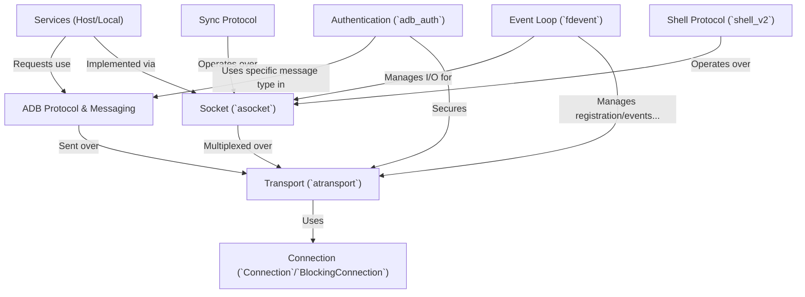

# Hy there
I tried to solve [this ctf](https://app.cyber-edu.co/challenges/558d25a0-7f21-11ea-a12a-6d2a55b1be9c?tenant=cyberedu) but I noticed I do not really now how ADB works under-the-hood. As such, I created this documentation using the amazing [Codebase Knowledge Builder](https://github.com/The-Pocket/Tutorial-Codebase-Knowledge?tab=readme-ov-file) project in hope I will finally understand the guts of ADB. Huge shoutout to [zachary62](https://github.com/zachary62) for creating this super-helpful and super-cool tool. Goated af, no cap 🙌
Some details:
- the codebase I used was can be found [here](https://android.googlesource.com/platform//system/core/+/5af75ed172e44c781a4feb81a71113612b7f21e6/adb) ([download link](https://android.googlesource.com/platform//system/core/+archive/5af75ed172e44c781a4feb81a71113612b7f21e6/adb.tar.gz)). 
- the command I used to generated the markdown files was `python ./Tutorial-Codebase-Knowledge/main.py --dir ./adb_codebase/ --include "*.c*" "*.h*" "*.txt" "*.TXT"` (where `./adb_codebase` is the unarchived codebase).
# Tutorial: adb_codebase

The Android Debug Bridge (**ADB**) provides a communication link between a host computer (**client** and **server**) and an Android device or emulator (**daemon**).
It allows developers to install apps, run shell commands, transfer files, and debug applications using *services*.
Communication happens over various physical *transports* (like USB or TCP), managed by an *event loop*, using a standardized *protocol* and multiplexed *sockets* for different data streams. *Authentication* secures the connection. Specialized protocols like *sync* and *shell_v2* handle file transfers and interactive shells, respectively.

**Source Repository:** [None](None)

## Chapters

1. [Connection (`Connection`/`BlockingConnection`)](01_connection___connection___blockingconnection__.md)
2. [Transport (`atransport`)](02_transport___atransport__.md)
3. [Authentication (`adb_auth`)](03_authentication___adb_auth__.md)
4. [ADB Protocol & Messaging](04_adb_protocol___messaging.md)
5. [Socket (`asocket`)](05_socket___asocket__.md)
6. [Services (Host/Local)](06_services__host_local_.md)
7. [Sync Protocol](07_sync_protocol.md)
8. [Shell Protocol (`shell_v2`)](08_shell_protocol___shell_v2__.md)
9. [Event Loop (`fdevent`)](09_event_loop___fdevent__.md)

---

Generated by [AI Codebase Knowledge Builder](https://github.com/The-Pocket/Tutorial-Codebase-Knowledge)