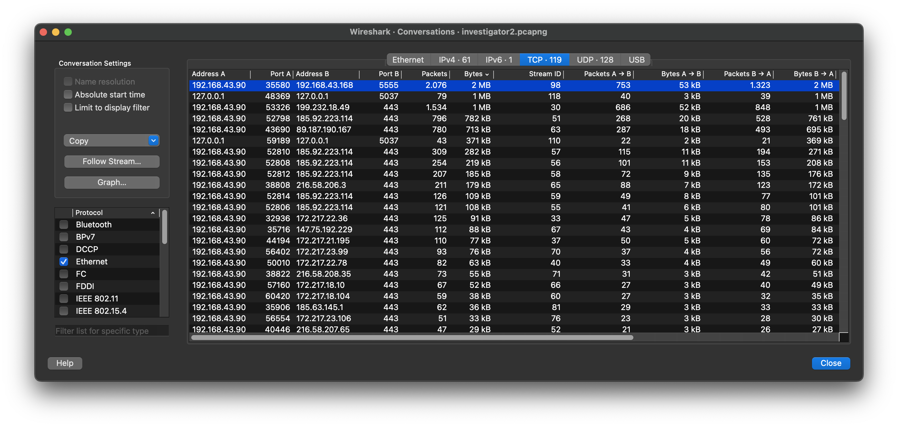
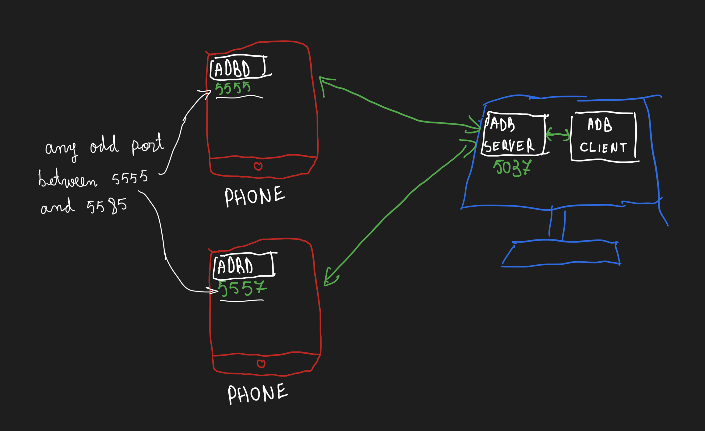

After some quick forensics, we can see that there is some serious communication happening on TCP stream no. 98:



Looking at the packets, we stumble upon ADB commands, so this must be ADB traffic.

First of all, let's see what the network topology is in a typical ADB connection. The [docs](https://developer.android.com/tools/adb) say there are three components. For simplicity, let's assume a typical use case where we connect to our phone via ADB. Since we are the ones sending the commands, our machine is called the `development machine`. Moreover, our machine runs two programs. The first one is our CLI tool (`adb`), which we use to send commands. In this topology, this CLI tool is a `client`. The client does not handle all the hard details regarding how to transmit data to our phone, since it should take into consideration many details, including whether it should communicate via USB or TCP. As such, it lets another program, the `server`, handle all of these. The `server` always runs on port `5037` of the `development machine`, and it is always on.

On the other hand, our phone has to run only one program: the `ADB Daemon`, which receives commands from the ADB server hosted on our development machine and executes them. Below is a small visualization:



Given that stream no. 98 is a communication between port 5555 and some other program, we can assume this is the communication between an ADB Daemon and an ADB server.

Looking through the pcap, we see that some interesting APKs are being copied onto the `development machine`'s hard drive. Let's extract them.

This is easier said than done, since Wireshark has little to no support for ADB, and any available Lua scripts for ADB are similarly useless. As such, we need to do custom tooling 💀

We will create a tool which, given a modified pcap, will extract the files transmitted over ADB. To make our lives easier, we will make the pcap for our app contain only a single TCP stream, with no duplicate packets and no packets without a payload. To create such a file, just run this:

```
tshark -r investigator2.pcapng -Y 'tcp.stream eq 98 && tcp.len > 0 && !tcp.analysis.retransmission' -w file2.pcapng
```

Notice: I tried to use `data.data` instead of `tcp.len > 0`, but that resulted in valid packets with TCP payloads being filtered out (which caused me some trouble), so we'll instead use `tcp.len`.

Now, I have already written the script. Since ADB has its own transport protocol over TCP, the script first concatenates all the TCP packets going in the same direction into something I call a GluedPacket. After that, I go through each packet and extract the ADB packets in them. After that step, we get a list of all the ADB packets used by the custom transport protocol and are able to filter and parse it in order to extract two APKs. The second one contains the obfuscated flag.

To get the APKs from the filtered-down version of our initial file, just run (this will output some colorful debug info regarding the processed packets):

```
python3 extract.py ./file2.pcapng --server-port 5555 --client-port 35580
```